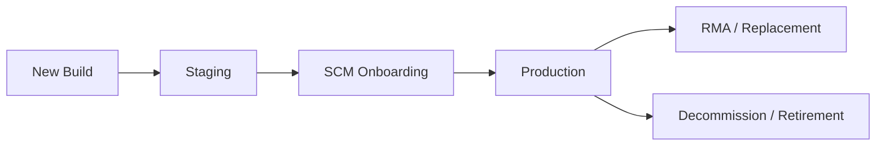
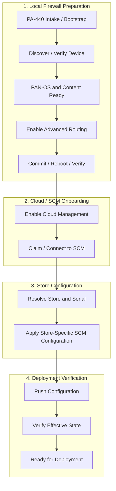
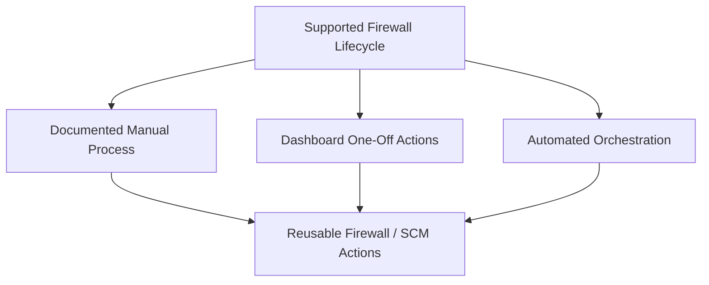

# Firewall Architecture

## Purpose

This folder documents the firewall lifecycle architecture for Strata Cloud Manager (SCM), including:

* new-store PA-440 builds,
* supported manual operations,
* automation/orchestration,
* dashboard/operator workflows,
* RMA/replacement,
* decommission/retirement,
* and technical reference material.

The architecture is intentionally **independent of any single orchestration platform**.

PowerShell Universal (PSU) is the current orchestration platform, but the supported firewall lifecycle and manual procedures must remain understandable and usable if PSU is unavailable, upgraded, or replaced.

---
## Current Focus

The immediate project is replacing Panorama-dependent **new-store PA-440 builds** with a Strata Cloud Manager workflow.

The broader architecture is designed around the firewall lifecycle:



The first production target is the New Build path.

RMA and Decommission remain separate workflows that reuse common lifecycle actions where appropriate.

---
## New Store High-Level Flow



A device should not advance simply because a job or API call completed successfully.

Major lifecycle transitions should be verified from observed state before the next step begins.

---
## Operating Model

The supported lifecycle should remain usable at multiple levels:



### Manual Process

The manual process is the human-readable definition of what must happen.

It should remain usable when automation or the dashboard is unavailable.

### Dashboard

The dashboard should provide visibility and approved one-off actions for operators.

It should implement the supported lifecycle rather than define a separate process.

### Automation

Automation should orchestrate the same reusable actions and verification points documented in the manual lifecycle.

The orchestrator is an implementation choice, not the architecture.

---
## Architecture Principles

1. **The lifecycle is independent of the orchestrator.**
2. **Manual procedures remain documented and supported.**
3. **Dashboard actions and automation use the same supported lifecycle.**
4. **Observed state is more important than job completion.**
5. **Unknown or conflicting state results in a hold, not an assumption.**
6. **Store-specific desired state remains separate from execution logic.**
7. **Store ↔ Serial assignment remains a platform-neutral integration contract.**
8. **New Build, RMA, and Decommission are separate workflows.**
9. **Common actions should be reusable across lifecycle workflows.**
10. **The UI/API model should remain portable to PSU v5 or another orchestrator.**
11. **Destructive lifecycle actions require strong identity validation and audit history.**
12. **Real-device regression testing should validate the lifecycle repeatedly before production cutover.**

---
## Documentation Map

### Start Here

#### [SCM New Store Firewall Lifecycle](SCM-New-Store-Firewall-Lifecycle.md)

Stakeholder-facing definition of the proposed new-store lifecycle, including the high-level flow and lifecycle phases.

#### [SCM Open Questions](SCM-Open-Questions.md)

Tracks unresolved architecture, operational, ownership, and lifecycle questions that require validation.

#### [SCM Jira Alignment](SCM-Jira-Alignment.md)

Maps lifecycle phases to proposed Jira workstreams so project work remains traceable to the supported process.

---
### Operational Process

#### [SCM New Store Manual Process](SCM-New-Store-Manual-Process.md)

Proposed orchestrator-independent manual runbook for new-store builds.

This should become the supported reference process for Network Engineering and Store Projects.

#### [SCM RMA Process](SCM-RMA-Process.md)

Working draft of the replacement/RMA lifecycle.

The current assumption is that RMA differs from a new-store build because the store's SCM configuration already exists and the replacement device must be attached to that existing configuration.

#### [SCM Decommission Process](SCM-Decommission-Process.md)

Working draft for retiring a firewall cleanly from SCM, Store ↔ Serial assignment, and inventory systems while preserving required history.

---
### Engineering Reference

#### [SCM Migration Ansible Reference Analysis](SCM-Migration-Ansible-Reference-Analysis.md)

Technical analysis of the existing Ansible SCM migration repository.

This document captures useful implementation evidence such as:

* Advanced Routing configuration paths,
* commit/reboot sequencing,
* cloud-management configuration,
* SCM authentication and claim behavior,
* folder/snippet operations,
* push/job behavior,
* and migration-specific behavior that should not be copied directly into the new-store workflow.

It is reference material, not the supported new-store process.

---
## Current Working Architecture

The architecture separates five major concerns:

```text
1. Local Firewall Staging
2. SCM Device Onboarding
3. Store-Specific Desired Configuration
4. Push / Verification / Deployment
5. Lifecycle State / History / Operations
```

### Local Firewall Staging

Responsible for:

* discovery,
* PAN-OS/content readiness,
* Advanced Routing,
* cloud-management enablement,
* local verification.

### SCM Device Onboarding

Responsible for:

* authentication,
* device claim,
* connection verification,
* folder/configuration scope,
* device association.

### Store-Specific Desired Configuration

Responsible for:

* Store ↔ Serial identity,
* StoreData,
* serial-specific `snp-{serial}`,
* store-specific variables,
* desired-vs-effective reconciliation.

### Push / Verification / Deployment

Responsible for:

* conflict detection,
* SCM push,
* job monitoring,
* effective-state validation,
* deployment readiness.

### Lifecycle State / History / Operations

Responsible for:

* current lifecycle state,
* current workflow stage,
* next action,
* retries,
* locks,
* audit history,
* dashboard visibility,
* RMA,
* retirement/decommission.

---
## Current Validation Strategy

Development should use repeatable real-hardware testing where possible.

The target lab loop is:

```text
Factory Reset
→ USB Bootstrap
→ DHCP / Base Configuration
→ Discovery
→ PAN-OS / Content
→ Advanced Routing
→ Cloud Management
→ SCM Onboarding
→ Store Configuration
→ Push / Verification
→ Reset and repeat
```

This provides regression testing against actual PA-440 behavior rather than relying only on mocked state.

---
## Stakeholder Review Topics

The following topics are expected to require stakeholder alignment:

* supported greenfield SCM onboarding order,
* definition of **Build Complete**,
* manual process ownership,
* RMA process ownership,
* Store ↔ Serial source of truth,
* StoreData ownership,
* SCM folder/snippet standards,
* dashboard one-off capabilities,
* pilot success criteria,
* production cutover expectations,
* RMA serial/snippet handling,
* decommission archive/delete policy,
* lifecycle audit and retention expectations.

See:

[SCM Open Questions](SCM-Open-Questions.md)

for the current working list.

---
## Documentation Status

|Document|Status|
|-|-|
|README / Architecture Overview|Working Draft|
|New Store Firewall Lifecycle|Working Draft|
|Open Questions|Working Draft|
|Jira Alignment|Working Draft|
|New Store Manual Process|Working Draft|
|RMA Process|Working Draft / validation required|
|Decommission Process|Working Draft / validation required|
|Migration Ansible Reference Analysis|Engineering reference|

---
## Change Management

This architecture is maintained in Git so lifecycle decisions and process changes remain version controlled.

Meaningful changes should be committed with enough context to explain:

* what changed,
* why it changed,
* what stakeholder or technical evidence drove the change,
* and which lifecycle/Jira workstream is affected.

The Git history should provide the authoritative evolution of the architecture over time.

