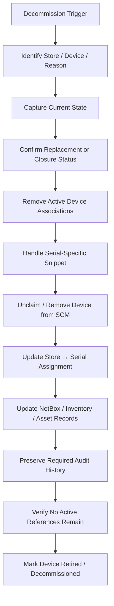

# SCM Firewall Decommission Process

## Status

**Working Draft — Stakeholder Review Required**

This document defines the proposed lifecycle for decommissioning or retiring a firewall from Strata Cloud Manager (SCM).

It is intentionally **orchestrator-independent**.

The final process must be validated with Network Engineering, Store Projects, asset/inventory owners, and any retention/compliance stakeholders before it is treated as the supported operational procedure.

---
# 1\. Purpose

Provide a clear, repeatable process for retiring a firewall without leaving stale SCM configuration, orphaned device associations, ambiguous Store ↔ Serial mappings, or incomplete inventory history.

This process should support scenarios such as:

* store closure,
* hardware refresh,
* permanent device retirement,
* replacement outside the normal RMA workflow,
* lifecycle cleanup after a successful RMA,
* lab device retirement,
* end-of-life hardware removal.

---
# 2\. High-Level Flow



---
# 3\. Architecture Principles

## 3.1 Decommission Is a Lifecycle Workflow

Decommission should not be treated as a one-off cleanup script.

It is the reverse lifecycle path for devices that were previously staged, onboarded, configured, and placed into production.

## 3.2 Preserve Evidence Before Destructive Actions

Before deleting, unclaiming, or removing SCM objects, capture enough state to explain:

* which device was retired,
* which store it belonged to,
* what configuration was associated,
* when the retirement occurred,
* why it occurred,
* what replaced it, if anything.

## 3.3 Remove Active References Deliberately

A retired serial should not remain indistinguishable from an active production serial.

The final process should make the device's status explicit.

## 3.4 Archive vs. Delete Is a Policy Decision

The architecture should not assume that every SCM object should be deleted.

Retention, troubleshooting, audit, and rollback needs may justify preserving some artifacts.

---
# 4\. Decommission Triggers

A decommission workflow may begin because of:

* store closure,
* permanent hardware retirement,
* hardware refresh,
* completed RMA replacement,
* inventory correction,
* failed or abandoned build,
* lab cleanup,
* platform migration.

The reason should be recorded as part of the decommission history.

---
# 5\. Phase 1 — Identify the Device and Reason

## Purpose

Confirm exactly which firewall is being retired and why.

## Required Information

Capture:

* firewall serial number,
* hostname,
* model,
* management IP if still reachable,
* store number,
* current SCM folder,
* current `snp-{serial}` association,
* current Store ↔ Serial assignment,
* lifecycle reason,
* replacement serial if applicable,
* ticket / change / RMA reference if applicable.

## Hold Conditions

Stop if:

* the serial cannot be uniquely identified,
* the store assignment is ambiguous,
* the device appears to be active but the retirement reason is unclear,
* a replacement is expected but has not yet been validated.

---
# 6\. Phase 2 — Capture Current State

## Purpose

Preserve the operational and configuration state before any destructive action.

## Capture

At minimum record:

* serial,
* hostname,
* store number,
* SCM connection state,
* SCM folder,
* configuration scope,
* associated snippet,
* store-specific variables,
* effective configuration state,
* most recent push/job state,
* lifecycle status,
* current Store ↔ Serial assignment.

Where appropriate, preserve:

* configuration snapshots,
* firewall running configuration,
* SCM export/reference information,
* NetBox or inventory metadata,
* RMA/replacement relationship.

## Expected Result

Enough information exists to reconstruct the device's previous role and configuration history if needed.

---
# 7\. Phase 3 — Confirm Replacement / Closure State

## Purpose

Avoid removing an active production device before the replacement or store-closure state is confirmed.

## Store Closure

Confirm:

* store is officially closed / decommissioning,
* no active deployment dependency remains,
* Store Projects / operations are aligned,
* retirement timing is approved.

## Hardware Replacement / RMA

Confirm:

* replacement firewall is staged,
* replacement is connected to SCM,
* replacement configuration is verified,
* production traffic has transitioned as required,
* old serial is no longer the active device.

## Hold Conditions

Do not retire the old device if the replacement is not proven ready.

---
# 8\. Phase 4 — Remove Active SCM Associations

## Purpose

Ensure the retired serial no longer participates in active SCM configuration.

Possible actions may include:

* remove device-to-snippet association,
* remove device-specific configuration scope,
* move device from an active production folder,
* mark/move device to a retired or quarantine location if supported,
* remove other serial-specific associations.

The final behavior should be validated against SCM operational standards.

## Verify

Confirm the retired device is no longer receiving active store configuration.

---
# 9\. Phase 5 — Handle the Serial-Specific Snippet

## Current Model

Store-specific configuration is currently represented by:

```text
snp-{serial}
```

The decommission process must define what happens to this object.

## Possible Policies

### Option A — Delete

Use when:

* historical configuration is preserved elsewhere,
* there is no need to retain the snippet,
* deletion is operationally safe.

### Option B — Archive / Rename

Example conceptual naming:

```text
retired-snp-{serial}
```

or:

```text
archive/{serial}
```

Use when:

* audit/history is valuable,
* engineers may need to inspect previous values,
* immediate deletion is undesirable.

### Option C — Retain with Retired Metadata

Use when SCM supports a clear inactive/retired representation that avoids confusion with active production snippets.

## Decision Required

The supported archive/delete policy is not yet defined.

---
# 10\. Phase 6 — Unclaim / Remove the Device from SCM

## Purpose

Remove the retired hardware serial from active SCM device management when appropriate.

## Open Implementation Question

The exact supported operation for unclaim/removal must be validated.

The migration rollback code demonstrates an SCM unclaim concept, but the decommission workflow should not assume the migration rollback implementation is the permanent production mechanism.

## Verify

Confirm:

* the serial is no longer active in the production SCM device set,
* no active associations remain,
* the device cannot be mistaken for a current production firewall.

---
# 11\. Phase 7 — Update Store ↔ Serial Assignment

## Purpose

Keep the canonical assignment data aligned with the lifecycle.

## Store Closure

The assignment may need to be:

* closed,
* retired,
* archived,
* or removed from the active assignment set.

## Replacement

If a new firewall replaced the retired device:

```text
Store 1234
Old Serial: ABC123
New Serial: XYZ789
```

The active assignment should point to the replacement while preserving the historical relationship.

## Recommended Principle

Do not simply overwrite history.

Preserve:

* old serial,
* new serial,
* effective date,
* reason,
* related RMA/change reference.

---
# 12\. Phase 8 — Update NetBox / Inventory / Asset Records

## Purpose

Ensure physical/inventory systems reflect the device's retirement.

Potential actions:

* update NetBox device/status,
* add journal entry,
* mark hardware retired,
* remove active site/device relationships,
* update asset tracking,
* capture disposal/RMA information.

## Recommended Audit Pattern

Use an explicit lifecycle record or journal entry containing:

* serial,
* store,
* date,
* reason,
* replacement serial if applicable,
* operator / automation source,
* related ticket/reference.

---
# 13\. Phase 9 — Preserve Audit History

## Purpose

Retain enough historical evidence to support:

* troubleshooting,
* audit,
* RMA review,
* store history,
* future architecture analysis,
* recovery from accidental cleanup.

## Candidate Retention Data

* Store ↔ Serial history
* decommission reason
* old snippet variables
* old folder/association
* final SCM state
* final firewall state
* replacement relationship
* relevant timestamps
* ticket/change/RMA references

---
# 14\. Phase 10 — Verify No Active References Remain

## Purpose

Ensure the retired device no longer appears as an active production dependency.

## Verify

Check:

* Store ↔ Serial assignment
* SCM device list
* SCM folder membership
* snippet association
* configuration scope
* active push targets
* dashboard/reporting
* NetBox/inventory state
* lifecycle database/history

## Expected Result

The retired device is clearly distinguishable from all active production devices.

---
# 15\. Phase 11 — Mark Decommission Complete

A firewall should be considered fully decommissioned only when:

* production dependency has ended,
* active SCM associations are removed or intentionally archived,
* serial-specific configuration has been handled according to policy,
* active Store ↔ Serial mapping is corrected,
* inventory systems are updated,
* required audit data is retained,
* no active references remain,
* final lifecycle state is recorded.

Final state should be explicit:

```text
DECOMMISSIONED
```

or:

```text
RETIRED
```

rather than simply disappearing from reporting.

---
# 16\. Suggested Lifecycle States

Potential lifecycle states:

```text
Production
ReplacementPending
PendingDecommission
Decommissioning
Retired
Archived
```

Exact terminology should be standardized with the broader firewall lifecycle model.

---
# 17\. Dashboard / Operator Experience

A future lifecycle dashboard may expose:

* current lifecycle state,
* decommission reason,
* replacement serial,
* pre-decommission validation,
* active SCM references,
* snippet disposition,
* assignment disposition,
* inventory update state,
* audit history,
* completion status.

Destructive actions should require explicit confirmation and strong identity validation.

---
# 18\. Safety Requirements

Decommission actions are potentially destructive.

Recommended safeguards:

* require exact serial confirmation,
* display store number and hostname prominently,
* prevent decommission while replacement validation is incomplete,
* require explicit confirmation for snippet deletion,
* require explicit confirmation for SCM unclaim/removal,
* preserve pre-change state before destructive operations,
* prefer archive/disable over irreversible deletion until policy is established,
* record all destructive actions in lifecycle history.

---
# 19\. Relationship to RMA

RMA and decommission are related but not identical.

A typical RMA may look like:

```text
Stage Replacement
→ Connect Replacement to SCM
→ Apply Existing Store Configuration
→ Verify Replacement
→ Transition Production
→ Decommission Old Serial
```

The decommission portion should reuse this document rather than embedding separate cleanup logic inside the RMA workflow.

---
# 20\. Open Questions

The following items require stakeholder validation:

* What is the authoritative trigger for decommission?
* What is the supported SCM unclaim/remove operation?
* Should `snp-{serial}` be deleted, archived, or retained?
* How long must historical configuration be retained?
* Should retired devices remain visible in SCM?
* What lifecycle status should NetBox use?
* Is a NetBox journal entry sufficient audit history?
* What data must Store Projects see?
* Who approves destructive SCM cleanup?
* Does a store closure have different retention requirements from hardware replacement?
* Should lab devices use the same retirement process?
* What should happen to failed/abandoned new-store builds?
* Are there compliance or records-retention requirements?
* What system is authoritative for historical Store ↔ Serial relationships?

Detailed unresolved items should also be tracked in:

[SCM Open Questions](SCM-Open-Questions.md)

---
# 21\. Related Documents

* [Firewall Architecture Overview](README.md)
* [SCM New Store Firewall Lifecycle](SCM-New-Store-Firewall-Lifecycle.md)
* [SCM New Store Manual Process](SCM-New-Store-Manual-Process.md)
* [SCM RMA Process](SCM-RMA-Process.md)
* [SCM Jira Alignment](SCM-Jira-Alignment.md)
* [SCM Migration Ansible Reference Analysis](SCM-Migration-Ansible-Reference-Analysis.md)
* [SCM Open Questions](SCM-Open-Questions.md)

