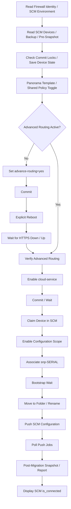

# SCM Migration Ansible Reference Analysis

## Purpose

This document summarizes the existing Palo Alto → Strata Cloud Manager (SCM) Ansible migration repository as **reference material** for firewall architecture and new-store workflow design.

It is **not** the supported new-store build process.

The migration repository contains multiple generations of migration workflows with different sequencing and behavior. The goal of this document is to capture reusable technical findings, proven configuration paths, verification methods, and implementation cautions.

---
# 1\. Repository Reviewed

```text
/Users/charlesschaffold/Documents/GitHub/Repository/pso-ansible-dsg-scm-migration
```

Review date:

```text
September 29, 2026
```

The source review covered:

* playbooks,
* roles,
* defaults,
* inventories,
* Python helpers,
* documentation,
* snapshots/reports,
* rollback playbooks,
* example/test playbooks.

No repository files were changed during the review.

---
# 2\. Executive Summary

The migration repository contains several different generations of the SCM migration workflow.

They should **not** be treated as one consistent implementation.

Key findings:

* Older playbooks remove local Panorama-related configuration and commit.
* Newer migration masters instead toggle Panorama template/shared-policy reception.
* No Panorama inventory-removal operation was identified.
* Advanced Routing is configured with:

```xml
<advance-routing>yes</advance-routing>
```

* Advanced Routing enablement uses:

```text
configure → commit → explicit reboot → wait → operational verification
```

* Runtime Advanced Routing verification uses:

```text
show system state
```

and searches for:

```text
cfg.general.advance-routing-enabled: True
```

* Cloud management is enabled by adding:

```xml
<cloud-service/>
```

under:

```text
/config/devices/entry[@name='localhost.localdomain']/deviceconfig/system/panorama
```

* Firewall-side cloud enablement and SCM device claim are separate operations.
* SCM claiming uses OAuth-authenticated tenant APIs.
* SCM connection reporting uses `is_connected` from the SCM device API.
* The migration masters do not require `is_connected == true` before continuing.
* The migration repository does not use `show cloud-management-status` as its cloud connection check.
* Later migration versions use fixed bootstrap waits rather than consistently polling until bootstrap is complete.

---
# 3\. Important Architecture Boundary

The migration repository is useful as evidence for:

* PAN-OS configuration paths,
* required commit/reboot behavior,
* SCM authentication,
* device claim mechanics,
* folder/snippet operations,
* push behavior,
* job polling,
* verification ideas.

It should **not** be copied directly into the new-store workflow.

Migration is a brownfield process.

New-store onboarding is a greenfield lifecycle with different assumptions.

---
# 4\. Migration Workflow Overview

One of the most complete migration sequences appears in:

```text
playbook_latest/scm_migration_final_v8.yml
```

Its written sequence is approximately:



Important: later versions do not necessarily prove every prior step succeeded before proceeding.

Several blocks rescue errors, record failure, or ignore errors and continue.

---
# 5\. Panorama Removal Findings

## 5.1 Older Cleanup Workflow

Older standalone cleanup playbooks attempt to remove local Panorama-related configuration from the firewall.

Common configuration prefix:

```text
/config/devices/entry[@name='localhost.localdomain']/deviceconfig
```

Paths targeted include:

```text
/system/panorama-server
/system/panorama-server-2
/system/panorama/panorama-server
/system/panorama/panorama-server-2
/system/panorama/log-collector-enabled
/system/panorama/log-forwarding-profile
/log-export-schedule
/system/panorama/local-panorama
/setting/management/initcfg/panorama-server
/setting/management/initcfg/tplname
/setting/management/initcfg/dgname
/setting/management/initcfg
/system/panorama
```

The cleanup then commits with:

```text
Remove Panorama management - migrating to SCM
```

### Limitations

* Many deletion tasks use `ignore_errors: true`.
* No reboot is required by this cleanup.
* No post-change Panorama connection verification is implemented.
* No explicit `device-auth-key` cleanup was identified.
* No operation deleting the firewall from Panorama inventory was found.

---
## 5.2 Newer Migration Masters

Later masters use operational commands instead of deleting the local Panorama configuration.

Example:

```text
set system setting template disable
set system setting shared-policy disable
set system setting template enable
set system setting shared-policy enable
```

These operations are described as immediate and do not require commit.

### Important Caution

This is migration-specific behavior.

It should **not** be considered equivalent to proving Panorama is disconnected.

Some later workflows ignore errors on these operations and still record success.

---
# 6\. Advanced Routing Findings

## 6.1 Configuration Path

Advanced Routing is written under:

```text
/config/devices/entry[@name='localhost.localdomain']/deviceconfig/setting
```

with:

```xml
<advance-routing>yes</advance-routing>
```

Important:

```text
advance-routing
```

is the configuration node name.

It is **not**:

```text
advanced-routing
```

---
## 6.2 Operational Verification

The migration workflow runs:

```text
show system state
```

and checks for:

```text
cfg.general.advance-routing-enabled: True
```

The migration code uses this as its runtime indication that Advanced Routing is active.

---
## 6.3 Enablement Sequence

The migration implementation explicitly performs:

```text
Set advance-routing=yes
        ↓
Commit
        ↓
Explicit system reboot
        ↓
Wait for TCP/443 to close
        ↓
Wait for TCP/443 to reopen
        ↓
Additional settle period
        ↓
show system state
        ↓
Verify advance-routing-enabled: True
```

The reboot is explicit.

The workflow does not rely on commit automatically restarting the firewall.

---
## 6.4 Configured vs. Running

The migration repository does **not** independently model:

```text
AdvancedRoutingConfigured
```

and:

```text
AdvancedRoutingRunning
```

Its primary routing gate is the operational `show system state` string.

Therefore both:

```text
not configured
```

and:

```text
configured but not active
```

can fall into the same mutation/reboot branch.

For the new-store architecture, tracking these separately is an improvement.

Recommended model:

```text
AdvancedRoutingConfigured
    = running configuration contains advance-routing=yes

AdvancedRoutingRunning
    = show system state contains
      cfg.general.advance-routing-enabled: True
```

---
# 7\. Routing Wait / Recovery Behavior

The v8 migration flow implements:

```text
wait_for port 443 state=stopped
delay=15
timeout=120
```

followed by:

```text
wait_for port 443 state=started
delay=30
timeout=600
sleep=60
```

Then:

```text
pause 30 seconds
```

followed by repeated `show system state` attempts.

This is useful as a reference for reboot handling:

```text
Commit
→ Reboot
→ Prove management went down
→ Prove management returned
→ Prove API is usable
→ Verify expected operational state
```

Port availability alone should not be treated as proof that the firewall is fully ready.

---
# 8\. Cloud Management Findings

## 8.1 Local Firewall Configuration

Cloud management is enabled under:

```text
/config/devices/entry[@name='localhost.localdomain']/deviceconfig/system/panorama
```

using:

```xml
<cloud-service/>
```

CLI equivalent documented in the migration repository:

```text
set deviceconfig system panorama cloud-service
```

The change is followed by a firewall commit.

No reboot is explicitly required by this step.

---
## 8.2 Important Separation

These are different lifecycle states:

```text
Cloud service configured locally
```

and:

```text
Device claimed in SCM
```

and:

```text
Device connected to SCM
```

They should not be collapsed into one status.

---
# 9\. SCM Authentication

The migration repository's SCM authentication role performs OAuth2 client-credential authentication.

Endpoint:

```text
POST https://auth.apps.paloaltonetworks.com/oauth2/access_token
```

Fields:

```text
client_id
client_secret
grant_type=client_credentials
scope=tsg_id:{tsg_id}
```

The returned access token is used for SCM tenant API requests.

---
# 10\. SCM Device Claim

A later migration master claims each firewall serial individually.

Endpoint used:

```text
POST https://admin.prod.panorama.paloaltonetworks.com/api/v2/device-registrations/claim
```

Authentication header:

```text
x-auth-jwt
```

Example request concept:

```json
{
  "devices": [
    "SERIAL"
  ],
  "labels": []
}
```

Observed behavior in the migration code:

* one serial per claim,
* HTTP 200/201 treated as success,
* retries are implemented,
* transient response handling includes rate limiting and server errors,
* successful serials are tracked before later SCM operations continue.

These endpoint details should be validated before reuse in the new-store production implementation.

---
# 11\. SCM Configuration Scope / Snippet / Folder Operations

The migration repository performs several SCM-side actions after claim.

## Configuration Scope

Conceptual endpoint:

```text
POST /api/sase/config/v1/device-config/device-containers
```

using the serial as the device container name.

## Snippet Association

Conceptual operation:

```text
PUT /sase/config/v1/snippets/{snippet-id}?device={serial}
```

The migration workflow looks for a serial-specific snippet:

```text
snp-{serial}
```

## Device Folder Movement

Conceptual operation:

```text
PUT /sase/config/v1/folders/{device-folder-id}/move
```

## Device Rename

Conceptual operation:

```text
PUT /sase/config/v1/folders/{id}
```

These operations are tenant-side SCM operations.

They do not represent local firewall configuration commits.

---
# 12\. SCM Push

The migration workflow uses an SCM push endpoint conceptually similar to:

```text
POST /api/sase/config/v1.0/push
```

and then polls job-group state.

Push handling includes:

* configuration conflict checks,
* push initiation,
* parent job monitoring,
* sub-job inspection,
* warnings for failed push sub-jobs.

This is useful reference behavior for the new-store push/verification workstream.

---
# 13\. SCM Connection Evidence

The migration master queries:

```text
GET {SCM_BASE_URL}/ngfw/api/v1/devices
```

and reads:

```text
is_connected
```

for the matching device/serial.

This is the strongest SCM-side connection indication identified in the migration repository.

### Important Limitation

The migration master displays `is_connected` but does not:

* poll until it becomes true,
* fail when it remains false,
* require it as a gate before declaring migration success.

The new-store lifecycle should improve on this.

Recommended architecture:

```text
CloudEnabled
    = local firewall cloud-management state

CloudConnected
    = SCM device API confirms is_connected
```

---
# 14\. Bootstrap Status

A separate migration helper queries a bootstrap-status endpoint conceptually similar to:

```text
GET .../ngfw/api/bootstrap/getbootstrapstatus?folder=All
```

and can inspect:

```text
bootstrap == done
```

for a serial.

However, later migration masters commonly use fixed wait periods instead of robust bootstrap polling.

Important distinction:

```text
Bootstrap complete
```

is not necessarily the same as:

```text
SCM connected
```

Both may be useful observations.

---
# 15\. Cloud Management Status Not Used Locally

The migration repository did **not** use:

```xml
<show><cloud-management-status/></show>
```

as its primary cloud-management verification mechanism.

It also did not implement a parser for:

* cloud endpoint,
* DNS state,
* TCP state,
* SSL state.

Those may still be useful in the new-store workflow, but they are not evidence derived from the migration implementation.

---
# 16\. Commit / Reboot / Wait Patterns

Useful patterns identified in the migration repository:

|Stage|Behavior|
|-|-|
|Commit-lock check|Detect existing firewall commit locks before mutations|
|Panorama cleanup|Delete configuration then commit|
|Advanced Routing|Configure → commit → reboot|
|Reboot wait|Wait for HTTPS down, then up|
|API recovery|Run operational command after management returns|
|Cloud service|Configure → commit with retries|
|Commit-job wait|Poll Commit / AutoCom jobs|
|SCM bootstrap|Often fixed wait in later masters|
|SCM push|Push then poll parent/sub-jobs|
|Rollback restoration|Load state → commit → reboot → wait → verify|

---
# 17\. Rollback Reference

Rollback playbooks provide additional evidence about required state transitions.

Examples include:

* restore device-state,
* disable Advanced Routing,
* re-enable Panorama configuration,
* unclaim device from SCM,
* commit,
* reboot,
* wait for management down/up,
* verify system information,
* poll auto-commit jobs.

These are recovery workflows.

They are not stages of the supported new-store process.

---
# 18\. Findings Useful for New-Store Architecture

|Finding|Classification|New-Store Use|
|-|-|-|
|`advance-routing` configuration node|Reusable exact configuration path|Use for configured-state detection and mutation|
|`show system state` routing flag|Reusable operational check|Use for running-state verification|
|`<cloud-service/>` configuration path|Reusable exact configuration path|Use for cloud-management enablement|
|SCM `is_connected`|Reusable SCM-side evidence|Use for CloudConnected|
|Commit → reboot → wait → verify|Reusable lifecycle pattern|Use for disruptive state changes|
|Commit-lock / job checks|Reusable operational pattern|Prevent overlapping mutations|
|SCM OAuth / claim APIs|Needs validation|Candidate for new-store SCM API module|
|Snippet association|Reusable concept|Supports `snp-{serial}` architecture|
|Folder / config-scope operations|Reusable concept|Supports new-store SCM placement|
|Panorama deletion logic|Migration-specific|Do not copy into greenfield builds|
|Template/shared-policy toggles|Migration-specific|Do not use as new-store connection proof|
|Rollback state restoration|Migration-specific|Reference only|

---
# 19\. Mapping to New-Store Discovery Fields

## PanoramaConnected

Migration repository:

```text
No reliable connection-state implementation found.
```

Panorama cleanup and operational toggles are not proof of actual connection state.

New-store discovery should continue to obtain this state independently.

---
## AdvancedRoutingConfigured

Migration evidence establishes the configuration writer:

```text
deviceconfig/setting/advance-routing = yes
```

The migration repository does not provide a dedicated configured-state reader.

New-store discovery should read the running configuration and normalize:

```text
yes / no / unknown
```

---
## AdvancedRoutingRunning

Best evidence from migration:

```text
show system state
```

containing:

```text
cfg.general.advance-routing-enabled: True
```

---
## CloudEnabled

Migration evidence establishes the writer:

```text
deviceconfig/system/panorama/cloud-service
```

The migration repository does not provide a dedicated local readback parser.

The new-store workflow may use its existing local cloud-management-status helper for this purpose.

---
## CloudConnected

Migration evidence:

```text
SCM device API → is_connected
```

This is a direct tenant-side connection indicator.

---
# 20\. Implementation Cautions

## 20.1 Success Labels Can Overstate Results

Several migration tasks:

* ignore errors,
* rescue failures,
* continue execution,
* assign success labels after nonfatal operations.

Do not copy those success semantics into the new-store state machine.

---
## 20.2 Fixed Waits Are Not State Verification

The migration workflow uses fixed waits in several places.

The new-store process should prefer:

```text
wait → rediscover → verify
```

instead of:

```text
sleep N minutes → assume success
```

---
## 20.3 Job Completion Is Not End-State Proof

A completed commit or SCM push job should not automatically advance lifecycle state.

The target state should be rediscovered and verified.

---
## 20.4 Multiple Migration Generations Exist

Different playbooks implement different ordering.

Examples include:

* cloud before routing in one onboarding path,
* routing before cloud in later masters,
* old Panorama config deletion,
* newer Panorama operational toggles,
* different bootstrap wait behavior,
* different folder/push sequencing.

The migration repository should be treated as technical reference evidence, not a single authoritative lifecycle definition.

---
# 21\. Open Technical Questions

The migration review did not establish:

1. A single confirmed production migration entry point.
2. A reliable Panorama-disconnected verification method.
3. Explicit device-auth-key cleanup behavior.
4. A dedicated configured-vs-running Advanced Routing reader.
5. A dedicated local cloud-enabled readback implementation.
6. A required SCM-connected gate.
7. Complete platform/version coverage for every target PA-440/PAN-OS version.
8. Which internal SCM API endpoints are formally supported for long-term automation.

These questions should remain visible until validated separately.

---
# 22\. Relationship to Firewall Architecture

This document is supporting evidence for:

* [SCM New Store Firewall Lifecycle](SCM-New-Store-Firewall-Lifecycle.md)
* [SCM New Store Manual Process](SCM-New-Store-Manual-Process.md)
* [SCM Jira Alignment](SCM-Jira-Alignment.md)
* [SCM Open Questions](SCM-Open-Questions.md)

The supported lifecycle should remain in those documents.

This file should remain a technical reference showing what was learned from the existing migration implementation.

