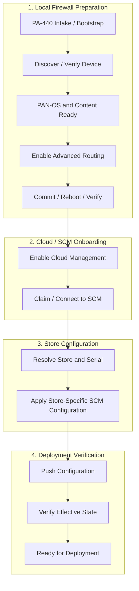
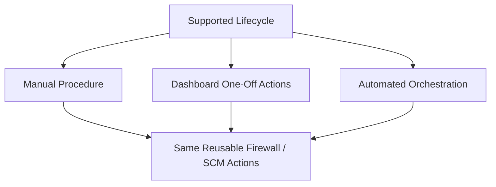

# SCM New Store Firewall Lifecycle

## Purpose

Define the supported lifecycle for staging and onboarding new-store PA-440 firewalls into Strata Cloud Manager.

This document describes **what must happen**, independent of the orchestration platform used to execute it.

---
## High-Level Flow

---
## Execution Model

The lifecycle must remain usable regardless of the orchestration platform.

* Manual procedure remains usable if automation is unavailable.
* Dashboard actions should expose the same supported steps.
* Automation should orchestrate the same actions rather than implement a separate process.
* PSU is the current orchestration platform, not the definition of the lifecycle.

---
## Lifecycle Phases

### 1\. Intake / Bootstrap

* PA-440 received
* USB bootstrap provides base configuration
* Management connectivity established
* DHCP / staging network reachable

### 2\. Discovery

* Identify firewall
* Validate serial and model
* Read current software/content state
* Determine Advanced Routing state
* Determine cloud-management state

### 3\. Software / Content Preparation

* Bring PAN-OS to approved version
* Bring required content to approved baseline
* Verify resulting device state

### 4\. Advanced Routing

* Enable Advanced Routing
* Commit
* Reboot
* Verify operational state after reboot

### 5\. Cloud Management

* Enable cloud-management configuration
* Commit
* Verify local cloud state

### 6\. SCM Onboarding

* Claim/register firewall
* Verify SCM sees the device
* Verify device connection state

### 7\. Store Assignment

* Resolve Store ↔ Serial mapping
* Preserve existing NetBox / store-build integration

### 8\. Store Configuration

* Create or reuse `snp-{serial}`
* Apply store-specific desired variables
* Apply target folder / configuration scope
* Associate device to desired SCM configuration

### 9\. Push / Verification

* Check for conflicts
* Push configuration
* Monitor jobs
* Verify effective configuration
* Do not advance on job completion alone

### 10\. Deployment Ready

* All required states verified
* Build visible in reporting/dashboard
* Firewall ready for Store Projects / deployment

---
## Jira Alignment

|Lifecycle Phase|Proposed Jira Workstream|
|-|-|
|Intake / Bootstrap|Firewall Intake \& Discovery|
|Discovery|Firewall Intake \& Discovery|
|Software / Content|Software \& Content Staging|
|Advanced Routing|Advanced Routing Preparation|
|Cloud Management|Cloud Management Enablement|
|SCM Onboarding|SCM Device Onboarding|
|Store Assignment|Store ↔ Serial Integration|
|Store Configuration|SCM Desired State / Snippets|
|Push / Verification|SCM Push \& Effective-State Verification|
|Deployment Ready|Reporting / Dashboard / Completion|
|Cross-cutting|Manual Runbook|
|Cross-cutting|Dashboard 2.0|
|Cross-cutting|Durable Workflow State / Audit History|
|Validation|Lab Reset / End-to-End Regression Testing|

---
## Completion Criteria

A firewall is not considered complete simply because an automation job succeeds.

Completion requires verified evidence that:

* required software/content is ready,
* Advanced Routing is active,
* cloud management is enabled,
* SCM shows the device connected,
* the correct Store ↔ Serial assignment exists,
* store-specific SCM configuration is associated,
* configuration push succeeds,
* effective state matches desired state.

---
## Related Documents

* [Open Questions](SCM-Open-Questions.md)
* [New Store Manual Process](SCM-New-Store-Manual-Process.md)
* [RMA Process](SCM-RMA-Process.md)
* [Jira Alignment](SCM-Jira-Alignment.md)
* [Migration Ansible Reference Analysis](SCM-Migration-Ansible-Reference-Analysis.md)

