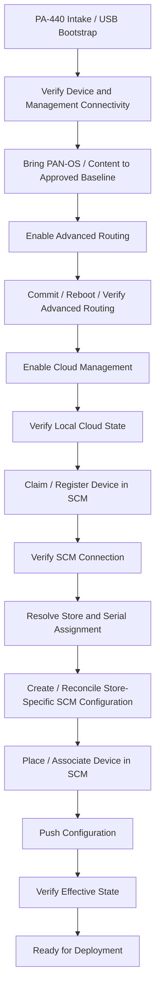

# SCM New Store Manual Process

## Status

**Working Draft — Stakeholder Review Required**

This document defines the proposed **manual new-store PA-440 build process** for Strata Cloud Manager (SCM).

It is intentionally **orchestrator-independent**.

PowerShell Universal (PSU), a future dashboard, or another orchestration platform may assist with these actions, but the supported lifecycle must remain understandable and executable without depending on a specific orchestrator.

Where the exact production command, API call, or ownership has not yet been finalized, this document identifies the step and required verification rather than inventing an implementation.

---
# 1\. Purpose

Provide Network Engineering and Store Projects with a supported, human-readable procedure for preparing, onboarding, configuring, and validating a new-store PA-440 firewall in SCM.

This manual process should serve as:

* the operational reference for one-off builds,
* the fallback process when automation is unavailable,
* the process automation is expected to implement,
* a training/reference document for Network Engineering,
* and the basis for validating Dashboard 2.0 one-off actions.

---
# 2\. High-Level Flow



---
# 3\. General Operating Principles

## 3.1 Process Independence

The manual process is the supported lifecycle.

The dashboard and automation should implement the same lifecycle rather than define a separate process.

```text
Supported Manual Process
        |
        +--> Manual Engineer
        +--> Dashboard One-Off Actions
        +--> Automated Orchestrator
```

## 3.2 Verify Before Advancing

A successful task, command, API call, or job completion is not sufficient proof that the firewall has reached the intended state.

Each major transition should be followed by direct verification.

## 3.3 Stop on Unknown or Conflicting State

If a required state cannot be confidently determined, the device should be placed on hold rather than advanced based on assumption.

## 3.4 Preserve Store Identity Separately from Platform State

The Store ↔ Serial relationship and store-specific desired configuration should remain independent of whether the device is managed by Panorama, SCM, PSU, or another orchestration platform.

---
# 4\. Required Inputs

Before beginning a new-store build, confirm the following are available:

* PA-440 firewall
* Supported USB bootstrap media
* Management/staging network connectivity
* Firewall serial number
* Store number
* Approved PAN-OS target version
* Approved content baseline
* Credentials/API access required for the local firewall
* SCM tenant access
* SCM API/service-account access where required
* Canonical Store ↔ Serial assignment
* StoreData for the target store
* Target SCM folder / configuration scope
* Expected serial-specific snippet naming convention: `snp-{serial}`

---
# 5\. Phase 1 — Intake / USB Bootstrap

## Purpose

Return the firewall to a known starting point and establish basic management connectivity.

## Manual Action

1. Install/confirm the supported USB bootstrap media.
2. Power on or factory-reset the PA-440 as appropriate.
3. Allow the firewall to consume the USB bootstrap configuration.
4. Confirm the firewall receives management connectivity using the expected staging/DHCP process.

## Expected Result

The firewall should reach a known base configuration and become reachable on the staging network.

## Verify

Confirm:

* management IP is reachable,
* HTTPS/API access responds,
* the device identifies as the expected PA-440,
* serial number matches the intended device,
* base hostname/bootstrap state is reasonable for staging.

## Hold Conditions

Stop if:

* the serial is not the expected device,
* the device is not a PA-440,
* management connectivity is unavailable,
* API authentication fails,
* the firewall unexpectedly reconnects to a legacy management system.

---
# 6\. Phase 2 — Discover / Verify Current Device State

## Purpose

Determine the actual firewall state before making changes.

## Observe

Capture at minimum:

* serial number,
* hostname,
* model,
* management IP,
* PAN-OS version,
* content versions,
* uptime,
* Panorama connection state,
* Advanced Routing configured state,
* Advanced Routing running state,
* cloud-management enabled state,
* cloud connection state.

## Expected Result

A normalized device observation exists and the next required action can be determined.

## Important State Distinctions

### Advanced Routing

Track configuration and operational state separately.

```text
Configured = no
Running    = no
```

means the feature still needs to be enabled.

```text
Configured = yes
Running    = no
```

means configuration exists but the routing engine is not yet active and a restart/verification may be required.

```text
Configured = yes
Running    = yes
```

means the routing prerequisite is satisfied.

### Cloud Management

Cloud management being configured locally is not the same thing as the device being connected in SCM.

Track those conditions separately.

---
# 7\. Phase 3 — PAN-OS / Content Baseline

## Purpose

Bring the firewall to the approved software/content baseline before SCM onboarding.

## Manual Action

1. Compare current PAN-OS version to the approved staging target.
2. Upgrade PAN-OS if required.
3. Update required content packages if required.
4. Complete any required reboot.
5. Reconnect to the firewall.

## Verify

Rediscover the firewall and confirm:

* PAN-OS version matches the approved target,
* required content versions are present,
* management connectivity has recovered,
* the device still reports the expected serial and model.

## Hold Conditions

Stop if:

* the firewall reports a version newer than the approved process supports,
* upgrade state is unclear,
* required content cannot be verified,
* the firewall fails to return after reboot.

---
# 8\. Phase 4 — Enable Advanced Routing

## Purpose

Enable the Advanced Routing engine required by the SCM design.

## Known Configuration Model

The existing migration automation configures the firewall under:

```text
/config/devices/entry[@name='localhost.localdomain']/deviceconfig/setting
```

with:

```xml
<advance-routing>yes</advance-routing>
```

The node name is `advance-routing`.

## Manual Action

1. Configure Advanced Routing.
2. Commit the change.
3. Reboot the firewall explicitly.
4. Wait for management HTTPS to become unavailable.
5. Wait for management HTTPS to return.
6. Allow the firewall to settle before validation.

## Verify

Confirm the firewall reports the Advanced Routing engine as active.

The existing migration implementation checks `show system state` for:

```text
cfg.general.advance-routing-enabled: True
```

Also confirm the running configuration contains the intended `advance-routing` setting.

## Expected Result

```text
AdvancedRoutingConfigured = yes
AdvancedRoutingRunning    = yes
```

## Hold Conditions

Stop if:

* the configuration cannot be committed,
* the device does not reboot cleanly,
* management access does not return,
* the configuration says enabled but the operational state remains inactive.

---
# 9\. Phase 5 — Enable Cloud Management

## Purpose

Prepare the firewall for SCM management.

## Known Configuration Model

The migration reference configures:

```text
/config/devices/entry[@name='localhost.localdomain']/deviceconfig/system/panorama
```

with:

```xml
<cloud-service/>
```

## Manual Action

1. Enable the firewall cloud-service setting using the approved local firewall method.
2. Commit the change.
3. Wait for commit completion.
4. Rediscover the device.

## Verify

Confirm the firewall reports cloud management as enabled.

Where available, capture:

* cloud-management enabled state,
* local connection state,
* endpoint/status details useful for troubleshooting.

## Expected Result

Cloud management is locally enabled before SCM claim/association proceeds.

## Important

Local cloud enablement does **not** by itself prove the device is connected to SCM.

---
# 10\. Phase 6 — Claim / Register Device in SCM

## Purpose

Associate the physical firewall serial with the SCM tenant.

## Manual Action

Use the approved SCM onboarding/claim process for the firewall serial.

The existing migration reference performs SCM claiming as a separate tenant-side action after local cloud enablement.

## Required Inputs

* Firewall serial
* SCM tenant / TSG context
* Approved SCM authentication method

## Verify

Confirm:

* the serial exists in SCM,
* the claim/registration succeeded,
* the expected device record is present.

## Hold Conditions

Stop if:

* the serial is already associated unexpectedly,
* the wrong tenant is selected,
* claim/registration status is ambiguous,
* the serial shown by SCM does not match the physical device.

---
# 11\. Phase 7 — Verify SCM Connection

## Purpose

Prove that the claimed firewall is actually connected to SCM.

## Verify

Use the SCM device record for the firewall serial and confirm the device reports connected.

The existing migration reference uses the SCM device API field:

```text
is_connected
```

as the direct SCM-side connection indicator.

## Expected Result

```text
CloudConnected = yes
```

## Hold Conditions

Do not continue solely because:

* claim returned success,
* the device exists in SCM,
* a fixed wait period expired.

The device should be confirmed connected.

---
# 12\. Phase 8 — Resolve Store ↔ Serial Assignment

## Purpose

Bind the physical firewall to the correct store identity.

## Manual Action

Confirm the canonical Store ↔ Serial assignment.

The current environment has existing assignment producers, including the NetBox store-build workflow and the existing firewall assignment process.

## Verify

Confirm:

* store number is correct,
* serial number is correct,
* the serial is not assigned to another active store,
* the store does not have an unresolved conflicting serial assignment.

## Hold Conditions

Stop on any duplicate or ambiguous assignment.

---
# 13\. Phase 9 — Resolve Desired Store Configuration

## Purpose

Determine the store-specific values that should be applied to the firewall.

## Source

Use the approved StoreData source for the target store.

The desired-state model should remain platform-neutral.

## Expected Store-Specific Values

Current architecture includes values such as:

```text
$loopback1
$store-net
$store-pos
$ae1-222
$ae1-555
$netflowIP
```

The exact production variable set should be confirmed against the current SCM template/snippet design.

## Verify

Review the desired values before applying them to SCM.

---
# 14\. Phase 10 — Create / Reconcile SCM Store Configuration

## Purpose

Apply the device-specific store values using the established SCM configuration model.

## Current Model

Store-specific configuration is represented by a serial-specific snippet named:

```text
snp-{serial}
```

Common store configuration is inherited from the SCM store hierarchy.

## Manual Action

1. Locate `snp-{serial}`.
2. Create it if the approved process requires creation and it does not exist.
3. Read existing variable values.
4. Compare current values with StoreData desired state.
5. Update only values that differ.
6. Confirm the snippet contains the correct store-specific values.

## Verify

Confirm desired and effective values match for the target serial.

## Hold Conditions

Stop if:

* the snippet is associated with the wrong serial,
* variable ownership is unclear,
* the existing values conflict with the expected store assignment,
* a required variable is missing from the approved model.

---
# 15\. Phase 11 — SCM Placement / Association

## Purpose

Place the firewall into the correct SCM hierarchy and associate its configuration.

## Manual Action

Using the approved SCM process:

* place/move the firewall to the target folder,
* enable configuration scope if required,
* associate `snp-{serial}`,
* apply the expected SCM display name,
* confirm required inherited configuration is present.

## Verify

Confirm:

* correct device serial,
* correct folder,
* correct configuration scope,
* correct snippet association,
* correct display name,
* expected inherited store configuration.

---
# 16\. Phase 12 — Push Configuration

## Purpose

Deploy the desired SCM configuration to the firewall.

## Manual Action

1. Check for SCM configuration conflicts.
2. Initiate the configuration push.
3. Monitor the parent job.
4. Monitor relevant child/sub-jobs.
5. Review failure details if any job does not complete successfully.

## Important

A push job reaching a terminal state does not automatically prove the desired configuration is active on the firewall.

---
# 17\. Phase 13 — Verify Effective State

## Purpose

Prove that the completed build matches the intended state.

## Verify

At minimum confirm:

* firewall is connected to SCM,
* Store ↔ Serial assignment is correct,
* target folder is correct,
* expected snippet is associated,
* store-specific variables match desired state,
* SCM push completed successfully,
* effective/config-sync state is healthy,
* firewall is not unexpectedly managed by Panorama,
* local prerequisite state remains healthy.

## Completion Rule

Do not mark the build complete until the expected end state is observed.

---
# 18\. Phase 14 — Ready for Deployment

## Purpose

Provide an unambiguous handoff point to Store Projects / deployment teams.

## Required Evidence

The firewall should be clearly identifiable as:

```text
READY FOR DEPLOYMENT
```

with supporting evidence for:

* Store number
* Firewall serial
* PAN-OS version
* Advanced Routing state
* Cloud-management state
* SCM connection
* SCM folder
* Snippet
* Store-specific desired/effective values
* Push result
* Final verification timestamp

---
# 19\. Dashboard Assistance

The dashboard may provide one-off actions that assist with this manual process.

Examples may include:

* Discover
* Upgrade PAN-OS
* Update Content
* Enable Advanced Routing
* Restart Firewall
* Enable Cloud Management
* Claim Device
* Reconcile Snippet / Variables
* Move / Associate Device
* Push Configuration
* Verify Build

These actions should be implementations of this process, not prerequisites for understanding or performing it.

---
# 20\. Failure / Recovery Principle

When a step fails:

1. Stop advancement.
2. Capture the observed state.
3. Determine whether the requested change actually occurred.
4. Correct or roll back as appropriate.
5. Rediscover the device.
6. Resume only from a verified lifecycle state.

Do not infer state solely from the status of the tool that attempted the action.

---
# 21\. Relationship to RMA

RMA is a separate lifecycle.

A replacement firewall is expected to reuse an existing store SCM configuration rather than recreate a new-store configuration from scratch.

See:

[SCM RMA Process](SCM-RMA-Process.md)

---
# 22\. Open Questions

Items that require stakeholder or engineering validation are tracked separately in:

[SCM Open Questions](SCM-Open-Questions.md)

That document should be updated as decisions are made so this runbook contains only supported/validated process over time.

---
# 23\. Related Documents

* [Firewall Architecture Overview](README.md)
* [SCM New Store Firewall Lifecycle](SCM-New-Store-Firewall-Lifecycle.md)
* [SCM Jira Alignment](SCM-Jira-Alignment.md)
* [SCM RMA Process](SCM-RMA-Process.md)
* [SCM Decommission Process](SCM-Decommission-Process.md)
* [SCM Migration Ansible Reference Analysis](SCM-Migration-Ansible-Reference-Analysis.md)
* [SCM Open Questions](SCM-Open-Questions.md)

