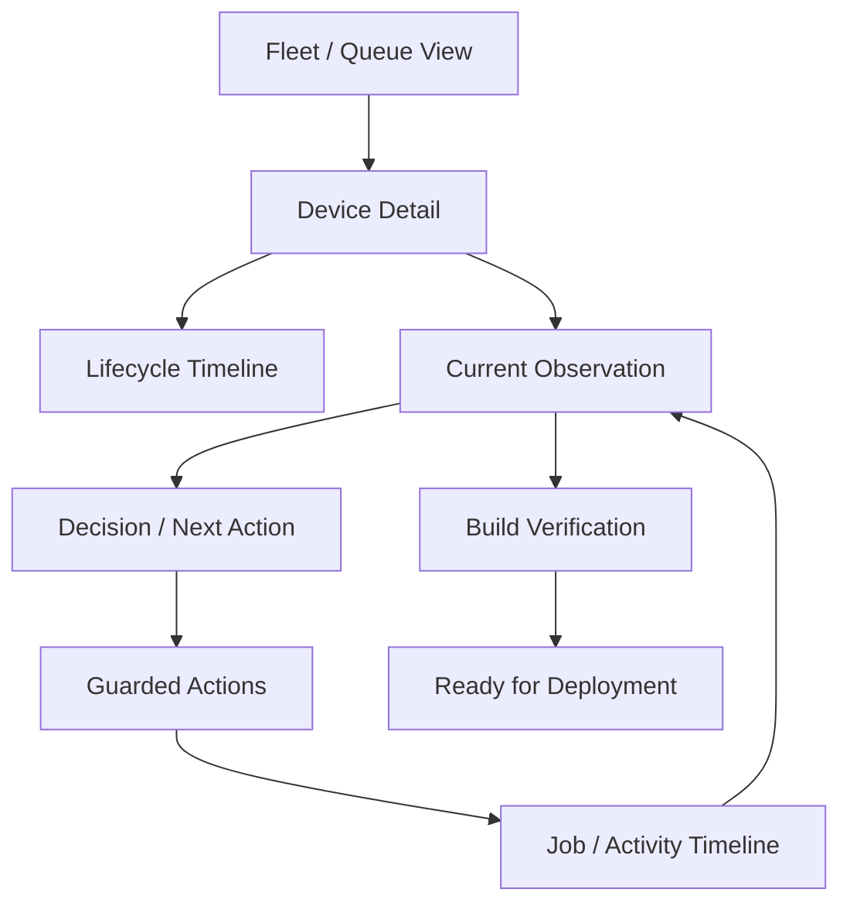
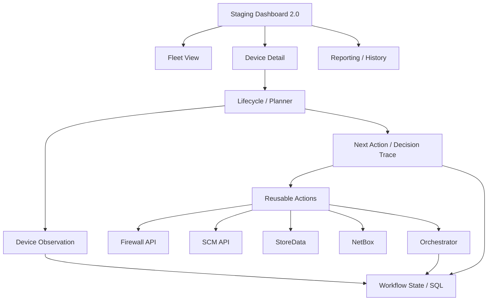
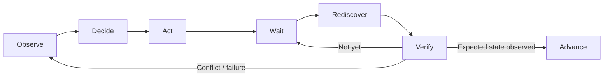
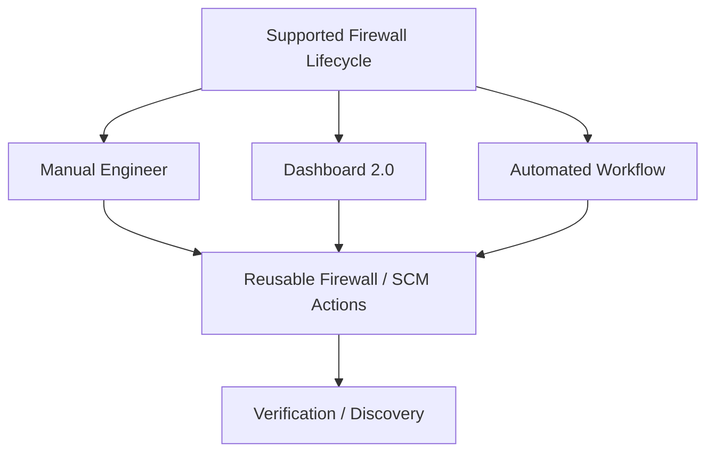

# SCM Staging Dashboard 2.0

## Status

**Working Draft — Architecture / Product Concept**

This document defines the proposed operating model and architecture for **Staging Dashboard 2.0**.

The dashboard is intended to provide a clear operational view of the firewall lifecycle while remaining independent of any one orchestration platform.

The core idea is:

> **Dashboard 2.0 shows where the firewall is, why it is there, and what can safely happen next.**

---

# 1. Purpose

Staging Dashboard 2.0 should give Network Engineering a single operational view for:

- new-store firewall staging,
- lifecycle progress,
- current observed device state,
- recommended next action,
- guarded one-off actions,
- active job status,
- build history,
- verification evidence,
- and troubleshooting context.

The dashboard should not become a generic command launcher.

It should expose the supported firewall lifecycle in a way that is easy to understand, safe to operate, and portable across orchestration platforms.

---

# 2. Product Goal

The dashboard should answer four questions immediately:

```text
1. What device am I looking at?
2. What state is it actually in?
3. What should happen next?
4. Why?
```

A fifth question should always be easy to answer:

```text
What already happened to this firewall?
```

That requires lifecycle history and verification evidence, not just a list of completed jobs.

---

# 3. High-Level User Experience



The dashboard should continuously move between:

```text
Observe
→ Decide
→ Act
→ Verify
→ Record
```

---

# 4. Fleet / Queue View

## Purpose

Provide the operational landing page for all firewalls currently moving through the staging lifecycle.

## Example

| Store | Serial | Lifecycle | Current Stage | Status | Last Observation |
|---|---|---|---|---|---|
| 1870 | 021201145933 | Staging | Advanced Routing | Action Required | 2 min ago |
| 1860 | 01890... | SCM Onboarding | Waiting for SCM | Waiting | 1 min ago |
| 1902 | 02231... | Staging | PAN-OS Upgrade | Running | 30 sec ago |
| 1920 | 02311... | Production | Complete | Ready | 5 min ago |
| 1844 | 01987... | Staging | Discovery | Hold | 3 min ago |

## Recommended Filters

- Store
- Serial
- Hostname
- Lifecycle
- Workflow stage
- Status
- Assigned engineer
- Job state
- Error / hold state
- Ready for deployment
- Last observation age

## Recommended Statuses

```text
READY
ACTION REQUIRED
RUNNING
WAITING
HOLD
FAILED
COMPLETE
```

The queue should make exceptions obvious.

---

# 5. Device Detail View

The device-detail page should be the main operational workspace for a single firewall.

## Header

Display identity prominently:

```text
Store:          1870
Serial:         021201145933
Hostname:       PSUStaged440-5933
Model:          PA-440
Management IP:  10.230.81.204
Lifecycle:      Staging
```

Identity should remain visible when an operator is about to perform an action.

---

# 6. Lifecycle Timeline

The lifecycle should be shown as a stateful timeline rather than a list of buttons.

```mermaid
flowchart LR

    A["Intake"]
    B["Discovery"]
    C["Software / Content"]
    D["Advanced Routing"]
    E["Cloud Management"]
    F["SCM Onboarding"]
    G["Store Assignment"]
    H["Store Configuration"]
    I["Push"]
    J["Verification"]
    K["Ready"]

    A --> B --> C --> D --> E --> F --> G --> H --> I --> J --> K
```



Each stage should expose a normalized state.

## Suggested Visual States

```text
✓ Verified
● Action Required
▶ Running
◷ Waiting
! Hold
✕ Failed
○ Not Started
```

The dashboard should distinguish:

```text
Lifecycle State
```

from:

```text
Workflow Execution State
```

For example:

```text
Lifecycle:      Staging
Workflow Stage: RestartFirewall
Job State:      Running
```

---

# 7. Current Observation Panel

## Purpose

Show what the systems currently know about the firewall.

This is the evidence layer.

## Example

```text
DEVICE OBSERVATION
────────────────────────────────

Store                  1870
Serial                 021201145933
Model                  PA-440
Hostname               PSUStaged440-5933
Management IP          10.230.81.204

PAN-OS                 11.1.13-h5
Content                Current

Panorama Connected     No

Advanced Routing
  Configured           Yes
  Running              No

Cloud Management       No
SCM Connected          No

SCM Folder             —
Snippet                 —

Last Discovery         2:08 PM
Observation Age        2 minutes
```

## Observation Principles

- Show actual observed state.
- Show `Unknown` rather than guessing.
- Show age/staleness of the observation.
- Do not translate job completion into device state.
- Allow engineers to drill into supporting evidence when useful.

---

# 8. Decision / Next Action Panel

## Purpose

Translate observed state into the next supported lifecycle action.

## Example

```text
NEXT ACTION

Restart Firewall

Reason:
Advanced Routing is configured but is not currently running.
```

The decision should include a visible trace.

## Example Decision Trace

```text
✓ Identity verified
✓ Supported PA-440
✓ Panorama disconnected
✓ PAN-OS compliant
✓ Content compliant
✓ Advanced Routing configured
✕ Advanced Routing not running
```

This makes the planner explainable to an engineer.

The dashboard should not contain a second independent copy of the planner logic.

It should consume the planner result from the backend.

---

# 9. Guarded One-Off Actions

The dashboard should support engineer-driven actions for recovery, testing, and one-off builds.

Potential actions:

```text
Discover Device
Upgrade PAN-OS
Update Content
Enable Advanced Routing
Restart Firewall
Enable Cloud Management
Claim Device in SCM
Verify SCM Connection
Reconcile Store Configuration
Associate / Move Device
Push SCM Configuration
Verify Build
```

## Guardrail Principles

Buttons should be state-aware.

Example:

```text
Enable Advanced Routing
DISABLED

Reason:
Advanced Routing is already configured and running.
```

Another example:

```text
Claim Device in SCM
DISABLED

Reason:
Cloud management has not been verified locally.
```

The UI should prevent obviously invalid lifecycle transitions.

---

# 10. Action Confirmation

Higher-risk actions should require explicit confirmation.

Examples:

- restart firewall,
- enable cloud management,
- claim/unclaim device,
- move SCM folder,
- delete/archive snippet,
- retire/decommission device.

## Confirmation Dialog Should Show

```text
Store
Serial
Hostname
Current stage
Requested action
Expected outcome
Potential impact
```

The operator should confirm the device identity, not just click "Yes."

---

# 11. Job / Activity Timeline

## Purpose

Provide a readable history of what happened to the firewall.

## Example

```text
14:03  Discovery                         SUCCESS
14:04  PAN-OS verified                   11.1.13-h5
14:04  Advanced Routing configured       YES
14:04  Advanced Routing running          NO
14:05  Restart requested                 Chuck
14:06  PSU Job 91827                     RUNNING
14:09  Firewall unreachable              Expected reboot
14:11  Firewall reachable                YES
14:12  Rediscovery                       SUCCESS
14:12  Advanced Routing running          YES
```

The timeline should combine:

- automated lifecycle events,
- operator actions,
- job launches,
- observations,
- verification results,
- failures,
- retries,
- manual overrides.

---

# 12. Build Verification

The dashboard should provide a final verification view before declaring a firewall ready.

## Example

```text
BUILD VERIFICATION

✓ Store / Serial assignment
✓ PAN-OS approved
✓ Content approved
✓ Panorama disconnected
✓ Advanced Routing configured
✓ Advanced Routing running
✓ Cloud management enabled
✓ SCM connected
✓ Correct SCM folder
✓ Correct serial-specific snippet
✓ Store variables reconciled
✓ Push successful
✓ Effective state verified
```

A build should not become complete because the final automation job returned success.

The expected end state must be directly observed.

---

# 13. Ready for Deployment

When all required checks pass, the dashboard should clearly show:

```text
READY FOR DEPLOYMENT
```

Supporting evidence should remain accessible.

Recommended summary:

```text
Store
Serial
Hostname
PAN-OS
SCM connection
SCM folder
Snippet
Push result
Final verification time
```

---

# 14. Fleet-Level Reporting

Dashboard 2.0 should also support operational reporting.

Potential views:

- firewalls currently staging,
- waiting for action,
- active jobs,
- holds,
- failures,
- ready for deployment,
- completed builds,
- average build duration,
- failure / retry counts,
- lifecycle stage aging.

Example:

```text
STAGING SUMMARY

Total Active              18
Action Required            4
Running                    3
Waiting                    2
Hold                       1
Ready for Deployment       8
```

---

# 15. Architecture

The dashboard should sit above a stable service/API layer.



---

# 16. Platform-Neutral Action Contract

The dashboard should not invoke PSU-specific implementation details directly.

Conceptually:

```text
Dashboard
    ↓
Stable Lifecycle / Action API
    ↓
Orchestration Implementation
```

Today:

```text
Stable API / Action Contract
    ↓
PSU v3
```

Later:

```text
Stable API / Action Contract
    ↓
PSU v5
```

Or:

```text
Stable API / Action Contract
    ↓
Another Orchestrator
```

The dashboard should require little or no redesign when the orchestration engine changes.

---

# 17. Responsibility Boundaries

## Dashboard Owns

- operator experience,
- lifecycle visualization,
- fleet/queue presentation,
- state display,
- decision explanation,
- guarded action initiation,
- activity/history presentation,
- deployment readiness presentation.

## Planner Owns

- state interpretation,
- next-action determination,
- lifecycle gating,
- decision trace.

## Reusable Action Layer Owns

- supported mutations,
- validation before execution,
- interaction with firewall/SCM/platform services.

## Orchestrator Owns

- job execution,
- scheduling,
- retries where appropriate,
- execution telemetry.

## SQL / Durable State Owns

- lifecycle/workflow state,
- locks,
- retries,
- latest observation metadata,
- active job identifiers,
- durable action history.

## External Systems Own

### SCM

- cloud-managed firewall configuration,
- device claim/connection,
- folders,
- snippets,
- push state.

### StoreData

- store-specific desired configuration source.

### NetBox

- infrastructure/inventory relationships and relevant store-build integration.

---

# 18. Durable Workflow Model

Dashboard 2.0 should not depend on a PSU job list as its workflow database.

A durable per-device workflow record should support fields conceptually like:

```text
Serial
StoreNumber
LifecycleState
WorkflowStage
LatestObservationTime
NextAction
ActiveJobId
RetryCount
LockOwner
LockExpiration
LastError
UpdatedTime
```

A separate history table should retain each attempted action and result.

---

# 19. Verification Loop

The central execution model should be:



This is more important than the particular orchestration technology.

---

# 20. Manual / Dashboard / Automated Paths

All supported execution paths should converge on the same underlying lifecycle operations.



This prevents three different versions of the process from evolving.

---

# 21. What Dashboard 2.0 Should Not Become

The dashboard should not become:

- a generic shell/PowerShell launcher,
- a direct front end to arbitrary PSU jobs,
- a second copy of planner logic,
- a replacement for durable workflow state,
- the authoritative StoreData source,
- the authoritative inventory database,
- a workflow that only works while PSU v3 exists.

---

# 22. Initial Dashboard 2.0 Scope

A reasonable first release could include:

1. Fleet / queue view
2. Search by Store / Serial
3. Device identity header
4. Lifecycle timeline
5. Current observation
6. Next action
7. Decision trace
8. Discover action
9. Approved one-off lifecycle actions
10. Active job status
11. Activity history
12. Final build verification
13. Ready-for-deployment state

Advanced reporting and RMA/decommission views can follow later.

---

# 23. Miro Mapping

For a stakeholder-level Miro board, use five primary groups:

```text
1. Fleet & Search
2. Device Lifecycle
3. Observation & Decision
4. Guarded Actions
5. History & Reporting
```

Below those, add a platform-services lane:

```text
Firewall API
SCM API
StoreData
NetBox
Workflow SQL
PSU / Orchestrator
```

Suggested visual:

```text
┌───────────────────┐
│ 1. Fleet & Search │
└─────────┬─────────┘
          ↓
┌─────────────────────┐
│ 2. Device Lifecycle │
└─────────┬───────────┘
          ↓
┌───────────────────────────┐
│ 3. Observation & Decision │
└─────────┬─────────────────┘
          ↓
┌────────────────────┐
│ 4. Guarded Actions │
└─────────┬──────────┘
          ↓
┌───────────────────────┐
│ 5. History & Reporting│
└───────────────────────┘


PLATFORM SERVICES
──────────────────────────────────────────
Firewall API | SCM API | StoreData | NetBox
Workflow SQL | PSU / Future Orchestrator
```

---

# 24. Open Design Questions

Items to validate with the team:

- What should the default fleet view show?
- What statuses are most useful to staging engineers?
- Which one-off actions belong in the first release?
- Which actions require elevated confirmation?
- Who can override a planner hold?
- Should operators be able to retry a failed action directly?
- How much raw firewall/SCM evidence should the UI expose?
- How should stale observations be represented?
- What should constitute a workflow timeout?
- How should assignment conflicts appear?
- What reports are needed by Store Projects?
- Should RMA use the same dashboard with a different lifecycle?
- Should Decommission use the same dashboard?
- Which workflow state belongs in SQL versus external systems?
- What API contract should isolate the UI from PSU v3/v5?

---

# 25. Relationship to Jira

Dashboard 2.0 should map to the broader SCM Jira workstreams rather than become one monolithic story.

Likely implementation areas include:

- Dashboard 2.0 / Operator Experience
- Durable Workflow State / Audit History
- Firewall Intake & Discovery
- SCM Device Onboarding
- Store ↔ Serial Integration
- SCM Desired State / Snippets
- Push & Effective-State Verification
- RMA / Lifecycle extensions

The dashboard is the operational surface over those capabilities.

---

# 26. Related Documents

- [Firewall Architecture Overview](README.md)
- [SCM New Store Firewall Lifecycle](SCM-New-Store-Firewall-Lifecycle.md)
- [SCM New Store Manual Process](SCM-New-Store-Manual-Process.md)
- [SCM Jira Alignment](SCM-Jira-Alignment.md)
- [SCM Open Questions](SCM-Open-Questions.md)
- [SCM RMA Process](SCM-RMA-Process.md)
- [SCM Decommission Process](SCM-Decommission-Process.md)
- [SCM Migration Ansible Reference Analysis](SCM-Migration-Ansible-Reference-Analysis.md)
