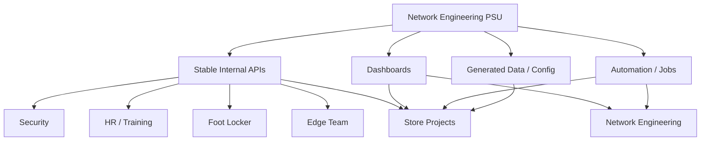

# PSU Automation Dependencies

## Status

**Working Inventory — Needs Ongoing Validation**

This document tracks teams, applications, workflows, and operational processes that depend on Network Engineering PSU automation, APIs, dashboards, generated data, or shared services.

The goal is to identify downstream consumers before:

- changing endpoints,
- redesigning dashboards,
- migrating PSU v3 to PSU v5,
- replacing orchestration,
- renaming APIs,
- changing response contracts,
- or retiring automation.

> **An automation or endpoint may have consumers far beyond the team that owns it.**

---

# 1. Why This Matters

PSU currently provides more than job execution.

It also exposes internal contracts consumed by other teams.

Examples include:

- REST endpoints,
- dashboards,
- scheduled jobs,
- generated configurations,
- lookup services,
- store/network data,
- operational reports.

A change that is safe for Network Engineering may still break a downstream consumer.

The target architecture should preserve the **contract** or deliberately migrate its consumers, even when the implementation behind that contract changes.

---

# 2. Dependency Categories

Track dependencies in the following categories:

```text
API / REST Endpoint
Dashboard
Scheduled Automation
Interactive PSU Job
Generated Configuration
Reporting / Notification
Machine-to-Machine Integration
Shared Data Service
```

---

# 3. Known Consumers

| Consumer / Team | Dependency | Type | Purpose | Criticality | Status |
|---|---|---|---|---|---|
| Security | `/meraki_wan_ipaddresses` (name to validate) | API | Consume Meraki/store WAN IP information | Needs Validation | Known Consumer |
| HR / Training Video systems | `/meraki_wan_ipaddresses` (name to validate) | API | WAN-IP related dependency for training-video access/workflow | Needs Validation | Known Consumer |
| Foot Locker Team | `/meraki_wan_ipaddresses` (name to validate) | API | Recently granted access to WAN-IP information | Needs Validation | Known Consumer |
| Edge Team | `/storedata/{storeNumber}` | API | Consume store/network configuration data | High | Known Consumer |
| Edge Team | `/service/edge/hci_mac_mapping/` | API | Retrieve information about how selected HCI MAC addresses map/connect to the network | Needs Validation | Known Consumer |
| Edge Team | `Map HCI Macs To Network Data.ps1` | PSU Script | Backend logic for HCI MAC mapping API | Needs Validation | Known Consumer |
| Edge Team | `Validate HCI MAC Mapping.ps1` | PSU Script | Validate HCI MAC/network mapping | Needs Validation | Known Consumer |
| Network Engineering | Firewall Upgrade Dashboard | Dashboard / Workflow | Firewall upgrade operations | High | Known Consumer |
| Store Projects | New Store Config Dashboard | Dashboard / Generated Config | Generate new-store configuration supplied to Bailiwick for switch configuration | High | Known Consumer |
| Store Projects | Store Build / staging dashboards | Dashboards / Jobs | New-store build and staging operations | High | Inventory Needed |
| Store Projects | Store Build automation | PSU Workflow | Build NetBox/Meraki/firewall foundation | High | Known Consumer |
| Store Projects / Edge staging | StoreData | API | Store addressing and configuration needed for staging | High | Known Consumer |

---

# 4. Edge Team Dependencies

Known Edge Team automation includes:

```text
DSGAutomate\IOS\Edge Team\Validate HCI MAC Mapping.ps1
DSGAutomate\IOS\Edge Team\Map HCI Macs To Network Data.ps1
```

The MAC mapping script is associated with:

```text
/service/edge/hci_mac_mapping/
```

The intent is to provide network-location / connection information for specified MAC addresses.

The Edge Team also consumes StoreData for store/network information.

## Needs Validation

- exact endpoint request contract,
- exact response schema,
- authentication method,
- callers,
- production frequency,
- error-handling expectations,
- whether any other Edge services depend on the same scripts.

---

# 5. Meraki WAN IP Endpoint

Known downstream consumers include:

```text
Security
HR / Training Video systems
Foot Locker Team
```

Current endpoint name is remembered as approximately:

```text
/meraki_wan_ipaddresses
```

**Needs Validation:** confirm the exact production route.

This endpoint should be treated as an established internal API contract until all consumers are identified and a migration plan exists.

## Dependency Record to Capture

```text
Endpoint
HTTP Method
Authentication
Response Schema
Source Data
Known Consumers
Business Purpose
Criticality
Owner
PSU v3 Host
Replacement Endpoint
Deprecation Plan
Last Validated
```

---

# 6. StoreData

StoreData is a high-impact shared service.

Known uses include:

- Store Projects build automation,
- Edge Team workflows,
- firewall desired-state derivation,
- temporary Edge staging,
- likely additional network automations.

Current route pattern:

```text
/storedata/{storeNumber}
```

Because StoreData has multiple consumers, changes to field names, hierarchy, null handling, or response shape should be considered API-contract changes.

## Target Principle

StoreData should have a documented response contract independent of the PSU implementation hosting it.

---

# 7. Network Engineering Dashboards

## Firewall Upgrade Dashboard

Consumer:

```text
Network Engineering
```

Purpose:

```text
Operational firewall upgrade workflow
```

This should be inventoried before any dashboard/framework migration.

Capture:

- source scripts,
- API calls,
- job names,
- state storage,
- credentials/auth model,
- active users,
- operational criticality,
- replacement plan.

---

# 8. Store Projects Dashboards

Store Projects relies on multiple Network Engineering PSU dashboards and automation workflows.

Known example:

## New Store Config Dashboard

Purpose:

```text
Generate new-store network configuration
```

The generated output is supplied to:

```text
Bailiwick
```

for switch configuration / staging.

This is an important cross-team contract even if the implementation is an interactive dashboard rather than a REST endpoint.

## Additional Store Projects Dependencies

**Inventory Needed**

Known areas include:

- new-store build,
- staging,
- generated configuration,
- device provisioning,
- server / Edge staging handoffs.

Each dashboard should be added to this document as its exact name and purpose are confirmed.

---

# 9. Store Build Automation as a Shared Dependency

The existing store-build process is itself a dependency chain.

Current key components include:

```text
BuildStoreProfile1.ps1
Edge Temp Staging.ps1
StoreData
NetBox
IPAM
Meraki
Palo store assignments
DNS
Napalm
Teams messaging
```

These dependencies should be considered when modernizing the SCM firewall portion.

The firewall migration should not accidentally disrupt the broader Store Projects workflow.

---

# 10. Dependency Architecture



The long-term goal is to make the contracts stable even if the execution platform changes.

---

# 11. Recommended Dependency Record

For every dependency, capture:

| Field | Description |
|---|---|
| Name | Endpoint, dashboard, script, report, or integration |
| Type | API, dashboard, job, generated config, etc. |
| Owner | Team responsible for implementation |
| Consumers | Known downstream teams/systems |
| Purpose | Why the consumer needs it |
| Host / Platform | PSU v3, PSU v5, other |
| Authentication | Current access model |
| Input Contract | Required parameters/request |
| Output Contract | Returned data/schema |
| Criticality | Low / Medium / High / Critical |
| Change Risk | What breaks if changed |
| Replacement | Future equivalent |
| Deprecation Required | Yes / No |
| Last Validated | Date / owner |
| Notes | Additional context |

---

# 12. Migration Rules

Before changing or retiring a dependency:

1. Identify known consumers.
2. Validate the actual current contract.
3. Determine whether the contract will remain unchanged.
4. If changing, provide a replacement path.
5. Notify consumers.
6. Support overlap when appropriate.
7. Verify consumers have migrated.
8. Only then retire the old implementation.

---

# 13. PSU v3 → PSU v5 Implication

A PSU migration should not be treated only as:

```text
Move scripts from v3 to v5
```

It should also answer:

```text
Which external contracts are hosted here?
Who calls them?
Will their URLs change?
Will authentication change?
Will response schemas change?
Will dashboard workflows change?
How will consumers be notified?
```

This dependency inventory should become an input to PSU migration planning.

---

# 14. API Contract Principle

Where practical, expose stable contracts such as:

```text
/storedata/{store}
/service/edge/hci_mac_mapping/
/meraki_wan_ipaddresses
```

independently from the orchestration engine.

Conceptually:

```text
Consumer
   ↓
Stable Internal Contract
   ↓
Implementation
   ├── PSU v3 today
   ├── PSU v5 later
   └── another service in the future
```

This reduces migration risk.

---

# 15. Discovery Tasks

The dependency inventory is incomplete.

Recommended discovery work:

- enumerate PSU REST endpoints,
- enumerate PSU dashboards,
- enumerate externally callable scripts,
- identify authentication/access groups,
- search logs for callers where possible,
- identify scheduled consumers,
- ask owning teams to validate dependencies,
- document generated files/configurations,
- identify Teams/email/report consumers,
- identify endpoints used by non-Network teams.

---

# 16. Known Items Requiring Exact Names / Validation

## Meraki WAN IP API

Working name:

```text
/meraki_wan_ipaddresses
```

**Needs Validation:** exact route and schema.

## Edge HCI MAC Mapping

Known route:

```text
/service/edge/hci_mac_mapping/
```

Known related scripts:

```text
Map HCI Macs To Network Data.ps1
Validate HCI MAC Mapping.ps1
```

**Needs Validation:** request/response contract and complete consumer list.

## Store Projects Dashboards

**Needs Inventory:** exact dashboard names and owners.

## Firewall Upgrade Dashboard

**Needs Validation:** exact dashboard name, supporting scripts, APIs, and workflow-state dependencies.

---

# 17. Open Questions

- Who owns dependency inventory maintenance?
- Should API contracts be versioned?
- Which endpoints require backward compatibility?
- Do any current consumers call PSU endpoints by hostname directly?
- Which consumers depend on exact JSON property names?
- Which consumers use service accounts versus user authentication?
- Which dashboards are business-critical during store deployment windows?
- Which integrations need formal SLAs?
- Should endpoint consumers be recorded in SQL/configuration rather than only documentation?
- Should PSU v5 cutover require consumer sign-off?
- Are there additional non-Network Engineering teams consuming StoreData or Meraki data?
- Which Store Projects dashboards generate artifacts sent to vendors other than Bailiwick?

---

# 18. Related Documents

- [Store Build — Current State](Store-Build-Current-State.md)
- [Store Build — Target Architecture](Store-Build-Target-Architecture.md)
- [SCM Staging Dashboard 2.0](SCM-Staging-Dashboard-2.0.md)
- [SCM New Store Firewall Lifecycle](SCM-New-Store-Firewall-Lifecycle.md)
