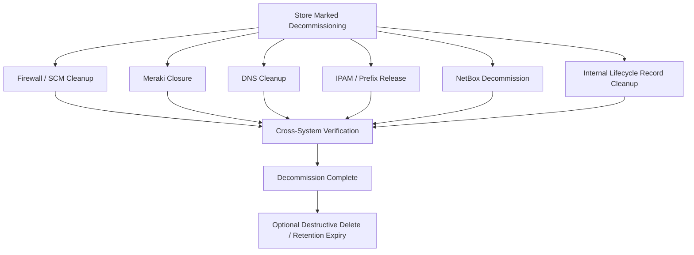

# SCM Decommission Process

## Status

**Working Draft — Target Architecture**

This document defines the proposed future store/firewall decommission lifecycle after migration from Panorama-managed firewalls to Strata Cloud Manager (SCM).

It is based on the cleanup responsibilities visible in the current process, while intentionally separating:

- store-level decommission,
- firewall SCM cleanup,
- inventory cleanup,
- IP/DNS cleanup,
- Meraki closure,
- lifecycle history,
- and final verification.

Anything not yet validated in SCM or with current process owners is marked **TBD / Requires Validation**.

---

# 1. Purpose

Replace the current collection of independent cleanup scripts with a controlled, observable, and auditable decommission lifecycle.

The target process should answer:

```text
What is being decommissioned?
Which cleanup domains are required?
What has completed?
What failed?
What was intentionally retained?
What can be safely deleted?
What evidence proves completion?
```

---

# 2. Core Principle

Decommissioning should be a lifecycle, not a single destructive script.

Target pattern:

```text
Observe
→ Plan
→ Lock
→ Act
→ Rediscover
→ Verify
→ Record
→ Advance
```

A job returning `Completed` is not enough.

The expected post-action state must be observed and verified.

---

# 3. Store Decommission as Parent Lifecycle



The parent Store Decommission should track all required child work items.

---

# 4. Decommission vs Delete

The future design should preserve the safety distinction already present in the current NetBox process.

## Decommission

Default lifecycle action:

```text
Operationally remove
Mark inactive/decommissioning
Detach active configuration
Retain history and identity
```

## Delete

Separate destructive action:

```text
Permanently remove retained objects
```

Deletion should require:

- explicit authorization,
- verified decommission completion,
- any required retention period,
- and a deliberate operator action or approved policy.

---

# 5. Proposed High-Level States

Suggested parent lifecycle:

```text
Requested
Validated
Decommissioning
VerificationRequired
Decommissioned
Retention
EligibleForDeletion
Deleted
Exception
```

Not every store must progress to `Deleted`.

`Decommissioned` should be a valid durable end state.

---

# 6. Pre-Decommission Validation

Before making changes, collect the current state of:

```text
Store
NetBox site
NetBox devices
Firewall serial(s)
Firewall role(s)
SCM management state
Meraki network/device
DNS records
NetBox prefixes
Custom IPAM allocations
Store ↔ Device assignments
Deployment / shipping history
```

The planner should determine required cleanup from observed state rather than assuming every store has identical objects.

---

# 7. Device Identity Model

Do not assume a store has only one firewall forever.

Use role-based relationships:

```text
StoreNumber
DeviceRole
Serial
LifecycleState
```

Examples:

```text
FirewallPrimary
FirewallSecondary
MerakiPrimary
MerakiSecondary
```

This allows the same decommission lifecycle to support current single-firewall stores and future HA designs.

---

# 8. Firewall / SCM Decommission Workstream

## Target Intent

The SCM branch replaces Panorama-specific cleanup such as:

```text
Log Collector Group membership
Device Group membership
Template Stack membership
Panorama Summary / managed-device entry
```

with SCM-native cleanup.

The exact SCM operations must be validated against the final production SCM configuration model.

Potential responsibilities include:

```text
Remove store-specific configuration relationships
Remove folder/device associations as required
Remove or clear store variable overrides
Disable or remove managed configuration
Release / remove device from SCM when appropriate
Verify device is no longer actively managed
```

**TBD / Requires Validation:** exact SCM APIs and required order.

---

# 9. Partial Firewall Decommission

The current Panorama workflow supports a partial-removal concept through:

```text
-DontRemoveCompletly
```

The target SCM process should explicitly decide whether an equivalent lifecycle state is required.

Possible future state:

```text
FirewallDetached
```

meaning:

```text
No active store configuration
No production policy relationship
Device identity retained for troubleshooting / transition
```

This should be an explicit state, not an accidental result of skipping a cleanup step.

---

# 10. Store / Firewall Assignment Cleanup

The target architecture should have a canonical store-to-device mapping.

Example:

```text
StoreDeviceAssignment
────────────────────────
StoreNumber
DeviceRole
Serial
Status
AssignedTime
ReleasedTime
```

During decommission:

```text
Active
→ Releasing
→ Released
```

The assignment history should not simply disappear.

Current assignment/shipping tables may be replaced or incorporated into the Store Build / lifecycle data model.

---

# 11. Deployment / Shipping History

Current tooling includes a concept of shipped-store records.

The future architecture should distinguish:

```text
Current operational assignment
```

from:

```text
Historical deployment / shipping event
```

Historical records should normally be retained for audit/troubleshooting rather than deleted just because a store is decommissioned.

**Requires Validation:** retention requirements.

---

# 12. Meraki Closure Workstream

The current known store-level action applies:

```text
closed_store
```

to the store Meraki device.

The target lifecycle should explicitly define desired Meraki end state.

Potential checks/actions include:

```text
Apply closed-store state/tag
Disable production connectivity if required
Remove obsolete routes
Handle VPN configuration
Retain or remove network
Retain or remove device claim
Handle cellular configuration
Verify final cloud-side state
```

**TBD / Requires Validation:** exact approved Meraki close-store behavior.

---

# 13. DNS Cleanup

DNS cleanup should be represented as a distinct work item.

Target pattern:

```text
Discover expected device DNS records
        ↓
Remove records
        ↓
Rediscover
        ↓
Verify records absent
```

A failed name resolution should not automatically prove that all expected DNS cleanup is complete.

The expected record set should come from known inventory/state.

---

# 14. NetBox Device Decommission

The default future action should follow the safe current pattern:

```text
status = decommissioning
```

rather than immediate deletion.

The target process should:

1. Discover store devices.
2. Determine which are in decommission scope.
3. Mark required devices decommissioning.
4. Verify resulting state.
5. Record action/history.

Deletion can occur later through a separate retention/deletion workflow.

---

# 15. NetBox Site Decommission

The site should be marked decommissioning after required child resources have reached their expected state.

Suggested order:

```text
Devices decommissioned
        ↓
Addressing cleanup complete
        ↓
DNS cleanup complete
        ↓
Site marked decommissioning
```

Whether the site should ever be physically deleted should be governed by retention policy.

---

# 16. Prefix Cleanup

The current process deletes NetBox prefixes associated with the store under a safety condition.

The target process should replace implicit safety heuristics with an explicit expected-prefix plan.

Conceptually:

```text
Discover Site Prefixes
        ↓
Compare to Expected Store Prefix Set
        ↓
Mark/Release Approved Prefixes
        ↓
Verify No Unexpected Prefixes Would Be Removed
```

**Requires Validation:** which prefixes should be deleted, retained, or marked available.

---

# 17. Custom IPAM Release

Known current custom allocations include:

```text
Store Edge
Store AP Mgmt
```

Target behavior:

```text
Discover allocation
        ↓
Verify allocation belongs to target store
        ↓
Release allocation
        ↓
Rediscover
        ↓
Verify returned to pool
```

This should preserve the current ownership check before release.

---

# 18. Durable Decommission State

Suggested parent record:

```text
StoreDecommission
────────────────────────
DecommissionId
StoreNumber
Status
RequestedBy
RequestedTime
StartedTime
CompletedTime
RetentionUntil
LastError
```

Child work items:

```text
StoreDecommissionWorkItem
────────────────────────
DecommissionId
WorkItemType
TargetRole
TargetId
Stage
Status
NextAction
ActiveJobId
RetryCount
LastVerified
LastError
```

Examples:

```text
1870 | Firewall | FirewallPrimary | serial | SCMCleanup | Verified
1870 | Meraki   | MerakiPrimary   | serial | Closure    | Verified
1870 | DNS      | StoreDevices    | store  | Removal    | Verified
1870 | IPAM     | Edge/AP         | store  | Release    | Verified
1870 | NetBox   | Site            | 1870   | Decomm     | Verified
```

---

# 19. Action History

Every attempted action should create history.

```text
StoreDecommissionActionHistory
────────────────────────
DecommissionId
WorkItemId
Action
RequestedBy
ExecutionSystem
ExecutionJobId
StartedTime
CompletedTime
Result
VerificationResult
Error
```

This keeps the difference between:

```text
Action succeeded
```

and:

```text
Expected state verified
```

visible.

---

# 20. Locking / Concurrency

Before executing a mutating action, the workflow should acquire an atomic lock for the relevant store/work item.

Potential fields:

```text
LockOwner
LockExpiration
ActiveJobId
```

This is especially important for destructive or release actions such as:

- device removal,
- IPAM release,
- assignment release,
- SCM detach/removal,
- final deletion.

---

# 21. Dashboard 2.0 Representation

Dashboard 2.0 should show store decommission progress as a lifecycle.

Example:

| Workstream | State |
|---|---|
| Firewall / SCM | Verified |
| Meraki | Verified |
| DNS | Complete |
| IPAM | Complete |
| NetBox Devices | Decommissioned |
| NetBox Site | Decommissioned |
| Assignment Release | Verified |
| Overall | Decommissioned |

The dashboard should also show:

```text
Current action
Last observation
Last verification
Errors
Retry count
Requested by
History
Retention status
```

---

# 22. Reusable Actions

Potential target actions:

```text
Get-StoreDecommissionState
Start-StoreDecommission
Remove-SCMStoreFirewallConfiguration
Release-StoreDeviceAssignment
Set-MerakiStoreClosed
Remove-StoreDnsRecords
Release-StoreCustomIpam
Set-NetBoxStoreDevicesDecommissioning
Set-NetBoxStoreSiteDecommissioning
Test-StoreDecommissionComplete
```

Exact function/API names are planning placeholders.

The important architectural goal is that actions should be reusable from:

- dashboard,
- manual engineering workflow,
- automation,
- or future orchestrator.

---

# 23. Target Verification Contract

A store should reach:

```text
Decommissioned
```

only after every required work item is verified.

Potential minimum completion contract:

```text
SCM Firewall Configuration Detached     VERIFIED
Store↔Firewall Assignment Released      VERIFIED
Meraki Closure State                    VERIFIED
DNS Removed                             VERIFIED
Custom IPAM Released                    VERIFIED
NetBox Devices Decommissioning          VERIFIED
NetBox Site Decommissioning             VERIFIED
```

Any intentionally retained items should be explicitly recorded rather than silently skipped.

---

# 24. Exception Handling

If one workstream fails, the entire decommission should not lose visibility.

Example:

```text
Firewall SCM Cleanup       Verified
Meraki Closure             Verified
DNS                        Verified
IPAM                       Failed
NetBox                     Pending
Overall                    Exception
```

The operator should be able to see:

```text
what failed
why it failed
what was already completed
whether retry is safe
what the next action should be
```

---

# 25. Destructive Deletion Workflow

Deletion should be a separate lifecycle after decommission.

Example:

```text
Decommissioned
        ↓
Retention Period
        ↓
Deletion Eligible
        ↓
Explicit Approval
        ↓
Delete Retained Objects
        ↓
Verify Deletion
```

This is safer than combining ordinary decommission and permanent deletion in one operational action.

---

# 26. Current-to-Target Mapping

| Current Behavior | Target |
|---|---|
| Panorama serial cleanup | SCM firewall cleanup work item |
| `DontRemoveCompletly` | Explicit partial-detach lifecycle state if required |
| NetBox `decommissioning` | Preserve as default |
| `DeleteAll` | Separate destructive deletion workflow |
| DNS removal | Verified DNS cleanup work item |
| Custom IPAM reset | Verified IPAM release work item |
| Meraki `closed_store` tag | Explicit Meraki closure state |
| PSU assignment deletion | Release assignment while retaining history |
| Shipped-store record deletion | Retain deployment history where appropriate |
| Separate scripts | Parent Store Decommission lifecycle |
| PSU job history | Durable SQL state + action history |

---

# 27. Recommended Implementation Path

```text
1. Document the current decommission tools
2. Confirm actual operational run order
3. Identify assignment/shipping cleanup ownership
4. Define the StoreDecommission SQL model
5. Build read-only current-state discovery
6. Build SCM firewall cleanup actions
7. Wrap existing NetBox/IPAM/DNS/Meraki actions behind stable contracts
8. Add rediscovery/verification after each action
9. Expose the lifecycle through Dashboard 2.0
10. Separate decommission from permanent deletion
```

---

# 28. Open Questions / Requires Validation

## Current Process

- What triggers store decommission today?
- Who performs each cleanup step?
- What is the real run order?
- Is `Decommission Store Firewall.ps1` still used?
- Where are active Store↔Serial assignments removed?
- Where are shipped-store/build records cleaned up?
- Is `DecommissionNetboxDevice.ps1` part of the standard process?

## SCM

- What SCM object represents the equivalent of Panorama device-group membership?
- What SCM cleanup is required for variable overrides?
- What is the correct device-release/removal API?
- Can a device remain claimed but detached from production config?
- What is the correct safe ordering?
- What state proves SCM cleanup is complete?

## Meraki

- Is `closed_store` tagging sufficient?
- Should the Meraki network remain?
- Should site-to-site VPN be disabled?
- Should routes be removed?
- What happens to cellular configuration?
- What should happen to the claimed Meraki device?

## NetBox / IPAM

- What is the intent behind the current `< 8 prefixes` safety guard?
- What objects must be retained for historical inventory?
- How long should `decommissioning` state be retained?
- When should custom IP allocations become reusable?

## Data / Audit

- What is the retention requirement for store/device assignment history?
- What deployment/shipping history must remain?
- Should Store Projects be able to view decommission status?
- Who can authorize permanent deletion?

---

# 29. Related Documents

- [Store Decommission — Current State](Store-Decommission-Current-State.md)
- [Store Build — Current State](Store-Build-Current-State.md)
- [Store Build — Target Architecture](Store-Build-Target-Architecture.md)
- [SCM New Store Firewall Lifecycle](SCM-New-Store-Firewall-Lifecycle.md)
- [SCM Staging Dashboard 2.0](SCM-Staging-Dashboard-2.0.md)
- [PSU Automation Dependencies](PSU-Automation-Dependencies.md)
