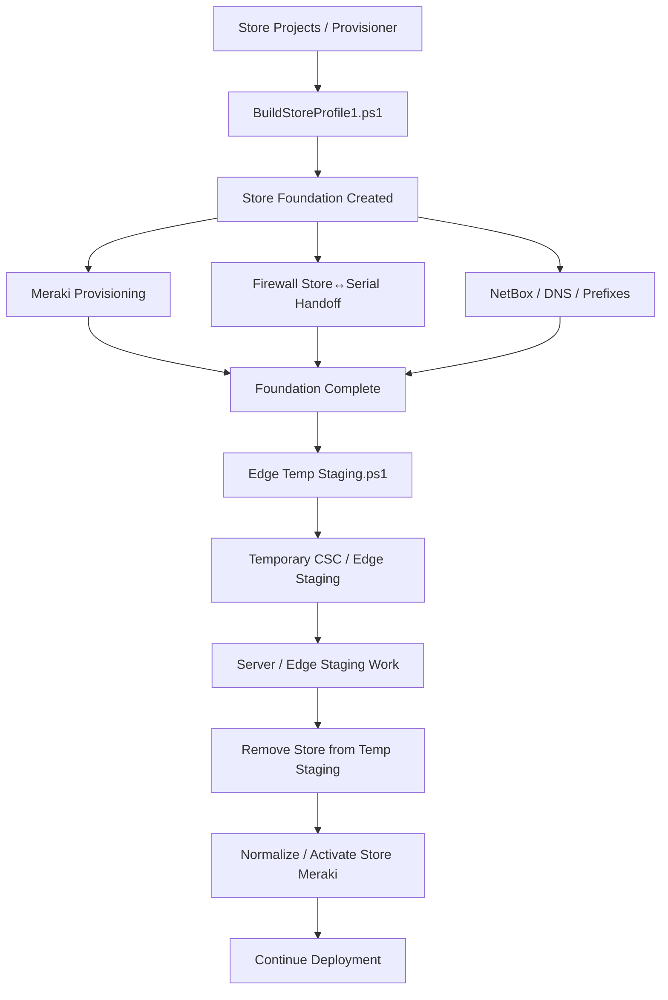
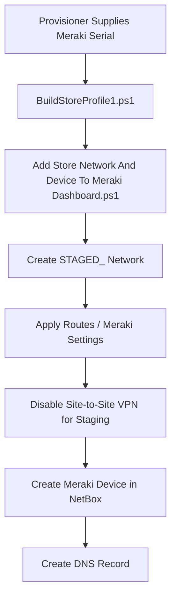
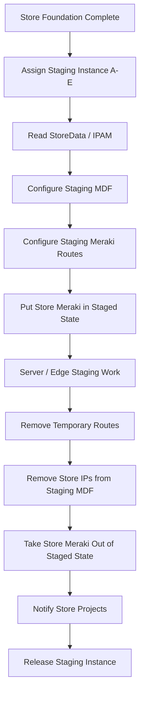

# Store Build — Current State

## Status

**Current-State Reference**

This document describes the existing Store Projects store-build flow centered on `BuildStoreProfile1.ps1` and the downstream `Edge Temp Staging.ps1` process.

The goal is to capture **what happens today** and the dependencies between phases. It is not a future-state design.

Anything not confirmed by the current scripts or team knowledge is marked **Needs Validation**.

---

# 1. Current Process at a Glance



The critical dependency is:

> `Edge Temp Staging.ps1` requires the Store Build foundation to already exist.

In particular, the NetBox site and the store-specific IPAM prefixes must already have been created and associated with the site before temporary staging can begin.

---

# 2. Store Projects Entry Point

Primary current build script:

```text
BuildStoreProfile1.ps1
```

Execution platform:

```text
PowerShell Universal (PSU)
```

The Store Projects / provisioning workflow supplies the store and device information used by the script.

Important inputs include:

```text
storeNumber
regionName
timeZone
groupName
address
contactPhone

createCreditFWRule

createMeraki
MerakiSerialNumber
MerakiImeid

createFirewall
PaloSerialNumber

createPrefixes

createVoiceGateway
VoiceGWModel

createMDF1
createIDF1
createIDF2
createIDF3

nonProd
```

When Meraki creation is selected, a Meraki serial is required.

When firewall creation is selected, a Palo Alto serial is required.

---

# 3. StoreData

The current build retrieves store-specific configuration from:

```text
/storedata/{storeNumber}
```

StoreData is used throughout the build for values such as:

- device names,
- management IP addresses,
- VLAN addressing,
- roles,
- and other store-specific configuration.

StoreData is already a core dependency of the Store Build process and is consumed by additional teams and automations outside this workflow.

---

# 4. NetBox Site Foundation

The build checks for an existing NetBox site using the store slug:

```text
store-{storeNumber}
```

If the site exists, it is reused.

If it does not exist, the build creates it using store metadata such as:

- region,
- group,
- timezone,
- address,
- contact information,
- description.

The NetBox site becomes the parent for the rest of the store infrastructure.

---

# 5. Store Infrastructure Objects

Depending on the selected build profile, the current script can create:

- Voice Gateway
- MDF
- IDF1
- IDF2
- IDF3
- Meraki device
- Firewall

For several device types, the current flow is:

```text
Create NetBox Device
→ Assign Management IP
→ Set Primary IP
→ Apply Tags
→ Create DNS Record
```

This infrastructure foundation is a prerequisite for later staging work.

---

# 6. Store Prefixes / IPAM Foundation

The current store build creates store prefixes after the site exists.

Conceptually:

```text
CreateStorePrefixes.ps1
```

Inputs include:

```text
storeNumber
siteID
```

The store-specific prefixes are associated to the NetBox site.

This is a hard prerequisite for `Edge Temp Staging.ps1`.

That downstream script expects the store-specific IPAM data to already exist and retrieves entries such as:

```text
XXXX Store AP Mgmt
XXXX Store Edge
XXXX Store Apps
```

---

# 7. Meraki Provisioning

## Current Input

The provisioning process passes the Meraki serial to the build.

The current Meraki flow uses:

```text
storeNumber
MerakiSerialNumber
store address
Meraki IMEI / cellular identifier
organization
```

## Current Flow



A later staging process changes the store Meraki network out of staged mode and enables the appropriate production behavior.

## Meraki Online State

Meraki cloud-side configuration can be prepared while the appliance is offline.

Therefore, the current staging process does not require the Meraki appliance to be online simply to establish its desired network configuration.

---

# 8. Firewall Handoff

## Current Input

The provisioning process passes:

```text
storeNumber
PaloSerialNumber
```

## Current Store ↔ Serial Assignment

The current build reads:

```text
GET /palo/store_assignments
```

and, when required, creates the store-to-firewall assignment using:

```text
POST /palo/store_assignments?storeNumber={storeNumber}&serial={PaloSerialNumber}
```

This is the current handoff into the firewall-staging process.

## NetBox / DNS

The build also:

- creates the firewall in NetBox,
- associates it to the store site,
- assigns its management IP,
- applies new-store tags,
- creates the firewall DNS record.

The future SCM lifecycle should consume this identity handoff rather than duplicate Store Projects ownership unnecessarily.

---

# 9. Store Foundation Completion

At the end of the initial Store Build phase, the environment has the prerequisite foundation needed for later staging.

Conceptually:

```text
NetBox Site
StoreData
Store-specific IPAM Prefixes
Infrastructure Device Records
Meraki Network / Device
Firewall Store↔Serial Assignment
DNS / Addressing Foundation
```

Only after this foundation exists should temporary Edge staging begin.

---

# 10. Edge Temporary Staging

Primary current script:

```text
Edge Temp Staging.ps1
```

The script supports staging instances:

```text
A
B
C
D
E
```

Each instance represents a reusable temporary staging environment.

## Important Dependency

`Edge Temp Staging.ps1` must run **after** the Store Build foundation has already been created.

It relies on:

- StoreData,
- the NetBox site,
- the store-specific IPAM prefixes,
- Meraki configuration,
- and existing staging infrastructure.

---

# 11. Add Store to Temporary Staging

The script retrieves store-specific addressing from StoreData, including:

- VLAN 222 / Credit
- VLAN 111 / Data

It also retrieves the store's assigned IPAM prefixes.

The staging environment then temporarily assumes the network identity needed to stage that store.

## Staging MDF

The selected staging MDF receives store-specific addresses on interfaces including:

```text
Vlan897
Vlan896
Vlan222
Vlan111
```

## Staging Meraki

The selected staging Meraki receives temporary routes for:

- Store Edge
- Credit
- Data

The script removes stale routes from the staging instance before adding the new store's routes.

---

# 12. Store Meraki During Temporary Staging

The script checks the Meraki dashboard for the store's Meraki network.

When found, it places that network into the appropriate staged state using the existing Meraki route/VPN script.

The current intent is to keep the store network in staged behavior while the temporary CSC / Edge environment is being used.

---

# 13. Remove Store from Temporary Staging

When `-removeStoreFromStaging` is used, the script performs the cleanup / handoff sequence.

It:

1. Removes Edge routes from the staging Meraki.
2. Finds the actual store Meraki network.
3. Updates the store Meraki out of staged mode.
4. Runs the Meraki route / VPN update.
5. Removes the temporary store IP addresses from the staging MDF.
6. Sends a Teams notification to Store Projects.

The notification indicates that the store has been removed from the Edge staging instance and is ready for the next Meraki / deployment step.

---

# 14. Current Temporary Staging Lifecycle



---

# 15. Current System Dependencies

The current Store Build / staging process depends on:

- PowerShell Universal
- StoreData
- NetBox
- IPAM / SolarWinds IPAM integration
- Meraki APIs / modules
- Palo store-assignment API
- DNS automation
- Napalm connectivity to staging switching
- Teams messaging
- shared staging Meraki devices
- shared staging MDF switches

These dependencies should be explicitly considered during PSU, API, dashboard, or orchestration changes.

---

# 16. Current Architecture Boundary

The Store Build process can be thought of as two major phases:

```text
PHASE 1 — BUILD FOUNDATION

BuildStoreProfile1.ps1
    ↓
NetBox / StoreData / IPAM
Meraki network and device
Firewall identity handoff
DNS / infrastructure objects

PHASE 2 — TEMPORARY EDGE STAGING

Edge Temp Staging.ps1
    ↓
Borrow store addressing
Configure staging MDF
Configure staging Meraki routes
Perform staging work
Release staging environment
Normalize store Meraki
```

The new SCM firewall lifecycle fits alongside and downstream of this foundation rather than replacing the entire Store Projects process.

---

# 17. Needs Validation

The following current-state items still need confirmation:

- What system or dashboard launches `BuildStoreProfile1.ps1` today?
- Which switches are mandatory for every supported new-store type?
- Exactly where is the firewall DHCP reservation created in the current Meraki workflow?
- What event triggers `Edge Temp Staging.ps1` for a new store?
- What team owns the decision to assign staging instance A-E?
- What work occurs between adding and removing the store from temporary staging?
- What is the authoritative trigger for `-removeStoreFromStaging`?
- Is the Teams notification currently the formal handoff back to Store Projects?
- What defines current Store Build completion?
- How are staging-instance collisions prevented today?
- Where is durable build history retained outside PSU job history?

---

# 18. Related Documents

- [Store Build — Target Architecture](Store-Build-Target-Architecture.md)
- [SCM New Store Firewall Lifecycle](SCM-New-Store-Firewall-Lifecycle.md)
- [SCM Staging Dashboard 2.0](SCM-Staging-Dashboard-2.0.md)
- [PSU Automation Dependencies](PSU-Automation-Dependencies.md)
