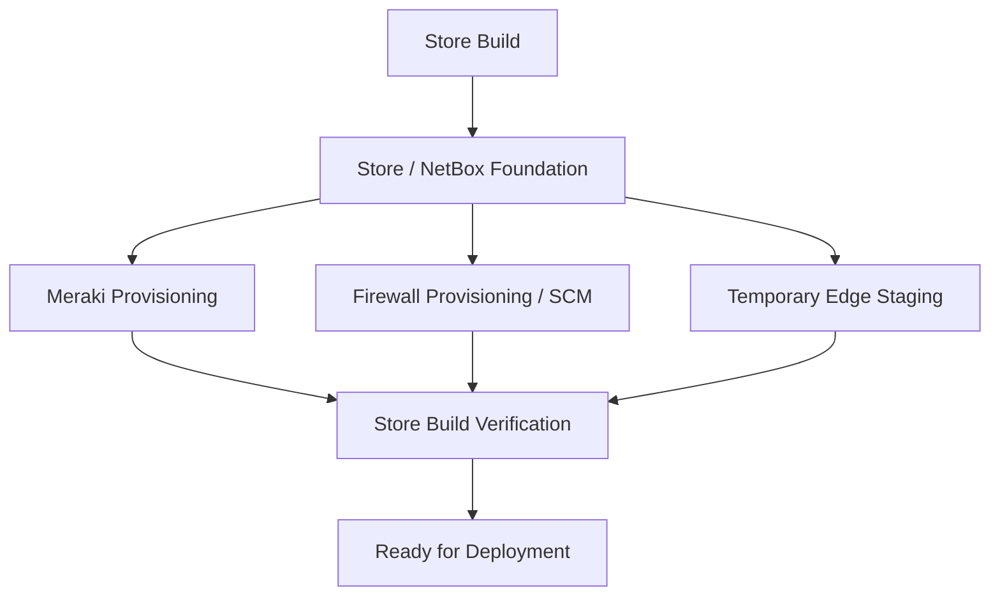
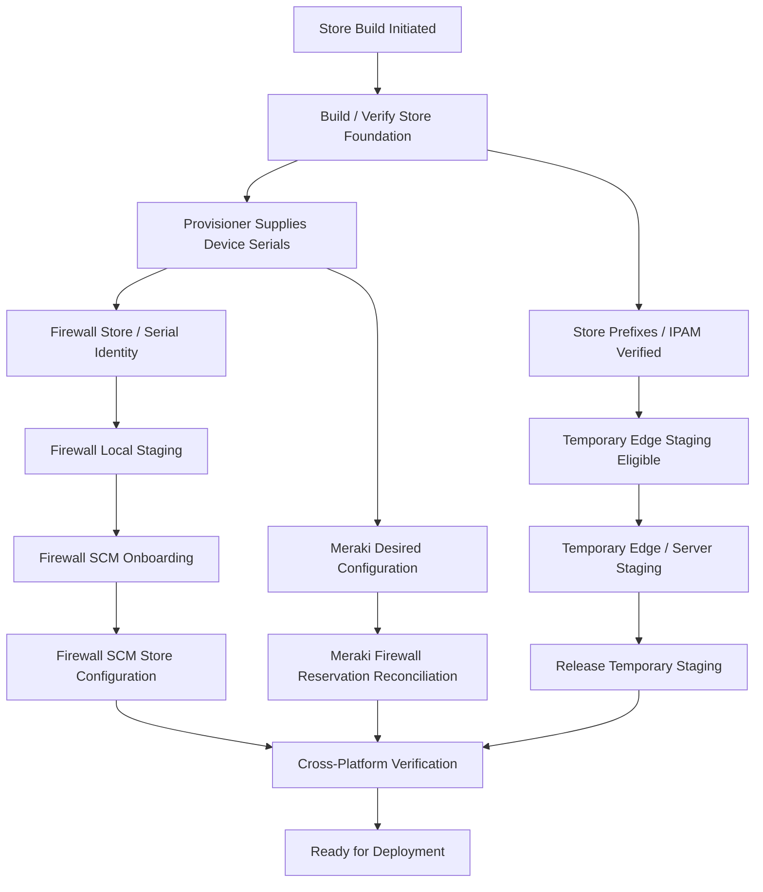
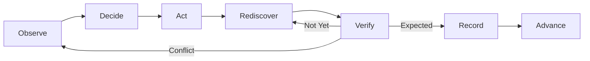
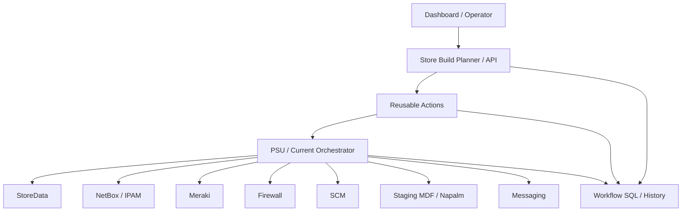

# Store Build — Target Architecture

## Status

**Working Draft — Planning / Target Architecture**

This document defines the proposed future architecture for Store Builds.

It preserves the useful parts of the existing Store Projects process while introducing explicit lifecycle state, SCM onboarding, durable history, Dashboard 2.0 visibility, and room for future HA/redundancy requirements.

Anything not yet tested or agreed is marked **TBD / Requires Validation**.

---

# 1. Target Outcome

The Store Build should become the top-level unit of work.

The architecture should be able to answer:

```text
What does this store require?
What foundation already exists?
What is currently running?
What is blocked?
What should happen next?
What evidence proves completion?
Who or what performed each action?
```

---

# 2. Core Architecture Principle

Separate:

```text
Process Definition
Execution
State / History
Presentation
```

Conceptually:

```text
Supported Store Build Lifecycle
        ↓
Planner / Reusable Actions
        ↓
PSU / Orchestrator
        ↓
External Systems

SQL = Durable State + History
Dashboard 2.0 = Operational View
```

PSU remains the execution engine **for now**.

It should not remain the only place where workflow state exists.

---

# 3. Store Build as Parent Lifecycle



Temporary Edge staging is **not** allowed to start until its Store Build prerequisites are verified.

---

# 4. Current Supported Minimum

The currently understood minimum network build is:

```text
1 PA-440 Firewall
1 Meraki
MDF connectivity between them
```

Meraki is required.

The future redundancy model is not yet defined.

---

# 5. Target Store Build Flow



Independent tasks should be allowed to run in parallel where no technical dependency exists.

---

# 6. Store Foundation

The target architecture should preserve the established Store Projects foundation where it already works.

Expected foundation components include:

- StoreData
- NetBox site
- store metadata
- store-specific IPAM prefixes
- MDF / IDF / voice infrastructure objects
- DNS
- Meraki network/device
- firewall Store ↔ Serial identity

The foundation should expose a verifiable state such as:

```text
StoreFoundation = Verified
```

rather than relying only on the fact that a PSU job completed.

---

# 7. Temporary Edge Staging Gate

Temporary Edge staging should be modeled as a downstream work item.

It should not begin until required prerequisites exist.

Potential eligibility checks:

```text
NetBox Site              VERIFIED
StoreData                AVAILABLE
Store Edge Prefix        VERIFIED
Credit Network Data      VERIFIED
Data Network Data        VERIFIED
Staging Instance         AVAILABLE
```

Then:

```text
TemporaryEdgeStagingEligible = true
```

---

# 8. Temporary Staging as a Managed Resource

The existing A-E staging instances are shared infrastructure.

The target architecture should explicitly track assignment and release.

Conceptual state:

```text
TemporaryStagingAssignment
────────────────────────────
StoreNumber
StagingInstance
Status
AssignedTime
ReleasedTime
LastVerified
LastError
```

Potential statuses:

```text
Available
Reserved
Configuring
InUse
Releasing
Available
Hold
```

This creates a durable answer to:

> Which store currently owns staging instance C?

---

# 9. Meraki Workstream

Meraki should remain a required Store Build workstream.

The current Store Projects process already does much of the provisioning.

Target Meraki state should focus on cloud-side desired configuration.

Required states may include:

```text
Meraki Network Created
Meraki Serial Assigned
Meraki Desired Configuration Applied
Firewall DHCP Reservation(s) Reconciled
Meraki Configuration Verified
```

Meraki online state can remain informational during staging when offline cloud configuration is acceptable.

---

# 10. Meraki DHCP Reservation Contract

The future action should be modeled as:

```text
Reconcile Required Firewall DHCP Reservations
```

not:

```text
Create One Firewall Reservation
```

Today:

```text
Expected Reservation Set
- FirewallPrimary
```

Possible future HA:

```text
Expected Reservation Set
- FirewallPrimary
- FirewallSecondary
```

The same dashboard/API contract should support both.

---

# 11. Firewall Workstream

The firewall lifecycle remains the more stateful branch.

```text
Store / Serial Identity
→ Bootstrap
→ Discovery
→ PAN-OS / Content
→ Advanced Routing
→ Cloud Management
→ SCM Claim
→ SCM Connection
→ Store SCM Configuration
→ Push
→ Effective-State Verification
→ Firewall Ready
```

See:

[SCM New Store Firewall Lifecycle](SCM-New-Store-Firewall-Lifecycle.md)

---

# 12. Store ↔ Device Identity

The future architecture should not assume one device forever.

Prefer role-based device relationships:

```text
Store
DeviceRole
Serial
```

Current:

```text
FirewallPrimary
MerakiPrimary
```

Possible future:

```text
FirewallPrimary
FirewallSecondary
MerakiPrimary
MerakiSecondary
```

This allows the build profile to evolve without redesigning the parent Store Build model.

---

# 13. Durable Store Build State

SQL should become the durable record of lifecycle progress.

Conceptual parent:

```text
StoreBuild
────────────────────────
BuildId
StoreNumber
StoreFormat
LifecycleState
OverallStatus
CreatedTime
UpdatedTime
ReadyTime
LastError
```

Child work items:

```text
StoreBuildWorkItem
────────────────────────
BuildId
WorkItemType
TargetRole
TargetId
Stage
Status
NextAction
ActiveJobId
RetryCount
LastVerified
LastError
```

Examples:

```text
1870 | Foundation | Site            | store-1870     | Complete | Verified
1870 | Meraki     | MerakiPrimary   | Qxxx-xxxx      | Config   | Verified
1870 | Firewall   | FirewallPrimary | 021201145933   | SCM      | Running
1870 | Staging    | EdgeInstanceC   | C              | InUse    | Verified
```

---

# 14. Action History

A separate action-history table should record what actually happened.

```text
StoreBuildActionHistory
────────────────────────
BuildId
WorkItemId
Action
RequestedBy
StartedTime
CompletedTime
ExecutionSystem
ExecutionJobId
Result
VerificationResult
Error
```

This allows the system to distinguish:

```text
PSU Job Completed
```

from:

```text
Expected State Verified
```

---

# 15. Verification Loop



The observed state advances the lifecycle.

The execution job does not.

---

# 16. Dashboard 2.0

Dashboard 2.0 should operate primarily at the **Store Build** level.

Example:

| Workstream | State |
|---|---|
| Store Foundation | Verified |
| Meraki Configuration | Verified |
| DHCP Reservation(s) | Verified |
| Firewall Staging | Running |
| SCM Onboarding | Not Started |
| Temporary Edge Staging | Complete |
| Overall | In Progress |

Engineers should be able to drill into the firewall lifecycle or temporary staging details as required.

See:

[SCM Staging Dashboard 2.0](SCM-Staging-Dashboard-2.0.md)

---

# 17. Execution Architecture



PSU does the work today.

The Store Build lifecycle, data contracts, and dashboard should survive a future orchestrator change.

---

# 18. Current vs Target

| Area | Current | Target |
|---|---|---|
| Store orchestration | PSU scripts/jobs | PSU initially, replaceable |
| Workflow state | Mostly implicit | Durable SQL |
| History | PSU/job history | Durable action + verification history |
| Foundation | BuildStoreProfile1.ps1 | Preserve and verify |
| Meraki | Provisioned in current build | Preserve, track explicitly |
| Firewall | Store/serial handoff | Full SCM lifecycle |
| Edge staging | Shared A-E process | Explicit managed work item |
| Completion | Process-specific | Verified Store Build completion |
| Operator view | Multiple tools | Dashboard 2.0 |
| HA | Not established | Model supports future extension |

---

# 19. Future HA / Redundancy

## Status

**TBD / Requires Validation**

Known planning considerations:

- possible second firewall,
- possible Meraki redundancy,
- second firewall DHCP reservation,
- WAN topology,
- failover behavior,
- shared WAN broadcast-domain requirements,
- deployment sequencing,
- rollback behavior.

The architecture should support those possibilities without claiming a final design exists.

No HA topology should be considered supported until tested and documented.

---

# 20. Store Build Completion

The currently envisioned completion model is:

```text
Store Foundation                VERIFIED
Meraki Desired Configuration    VERIFIED
Firewall DHCP Reservation(s)    VERIFIED
Firewall Local State            VERIFIED
SCM Connection                  VERIFIED
SCM Store Configuration         VERIFIED
SCM Effective State             VERIFIED
Temporary Edge Staging          COMPLETE / RELEASED
```

Then:

```text
READY FOR DEPLOYMENT
```

**Requires Validation:** exact ownership and definition of `Ready for Deployment`.

---

# 21. Open Questions / Requires Validation

## Store Build

- What system creates the durable Store Build record?
- When should the record be created?
- Who owns overall build completion?
- Which current PSU steps are mandatory for every store format?

## Temporary Edge Staging

- What triggers assignment of an A-E staging instance?
- Who owns staging-instance allocation?
- How are collisions prevented today?
- What exact event allows the staging instance to be released?
- What work happens while the store is attached to temp staging?

## Meraki

- Confirm exactly where current firewall DHCP reservation creation occurs.
- Confirm exact Meraki completion criteria.
- Confirm whether the later rename/VPN activation remains part of the target process.
- Determine how a second firewall reservation would be supplied.

## Firewall

- Confirm greenfield SCM onboarding order.
- Confirm final Store ↔ Serial API/data contract.
- Define future primary/secondary firewall role handling.

## HA

- Define firewall HA topology.
- Define Meraki redundancy topology.
- Validate WAN broadcast-domain requirements.
- Reproduce failover design in the lab before production adoption.

## Data / SQL

- Which database owns Store Build lifecycle state?
- What history/retention is required?
- What Store Projects events should be retained?
- Should external consumers have a read-only Store Build API?

---

# 22. Recommended Evolution Path

```text
1. Document and preserve current BuildStoreProfile1.ps1 behavior
2. Document and preserve current Edge Temp Staging behavior
3. Add durable Store Build / work-item state
4. Record existing NetBox / Meraki / staging outcomes
5. Replace Panorama-dependent firewall lifecycle with SCM
6. Expose the Store Build lifecycle through Dashboard 2.0
7. Define verified completion
8. Design/test HA separately
```

This allows gradual modernization without destabilizing the current Store Projects workflow.

---

# 23. Related Documents

- [Store Build — Current State](Store-Build-Current-State.md)
- [SCM New Store Firewall Lifecycle](SCM-New-Store-Firewall-Lifecycle.md)
- [SCM New Store Manual Process](SCM-New-Store-Manual-Process.md)
- [SCM Staging Dashboard 2.0](SCM-Staging-Dashboard-2.0.md)
- [SCM Open Questions](SCM-Open-Questions.md)
- [PSU Automation Dependencies](PSU-Automation-Dependencies.md)
