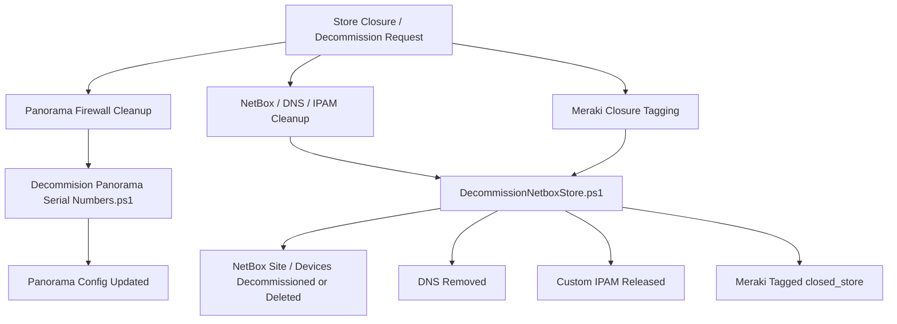

# Store Decommission — Current State

## Status

**Current-State Reference**

This document describes the store decommission process as it exists today across the known PowerShell Universal (PSU), Panorama, NetBox, DNS, IPAM, and Meraki tooling.

The current process is **not one single orchestration**. It is composed of separate tools that clean up different parts of the store/network lifecycle.

Anything not confirmed by the current scripts or team knowledge is marked **Needs Validation**.

---

# 1. Purpose

Document the existing store decommission process so the future SCM-based lifecycle can preserve required cleanup behavior without assuming that today's implementation is already centralized.

This document should answer:

- what is decommissioned today,
- which scripts perform each cleanup domain,
- what is marked decommissioning versus deleted,
- what data is retained,
- what current dependencies exist,
- and what remains unclear.

---

# 2. Current Process at a Glance



There is currently no confirmed evidence that these actions are coordinated by one durable store-decommission workflow.

---

# 3. Known PSU Decommission Tools

The current PSU environment contains at least the following scripts:

```text
Decommision Panorama Serial Numbers.ps1
Decommission Store Firewall.ps1
DecommissionNetboxDevice.ps1
DecommissionNetboxStore.ps1
```

Known usage:

| Script | Current Status |
|---|---|
| `Decommision Panorama Serial Numbers.ps1` | **Confirmed in use** |
| `Decommission Store Firewall.ps1` | **Usage Needs Validation** |
| `DecommissionNetboxStore.ps1` | Known current store-level cleanup tool |
| `DecommissionNetboxDevice.ps1` | Role in standard process **Needs Validation** |

---

# 4. Panorama Firewall Decommission

## Confirmed Current Script

```text
Decommision Panorama Serial Numbers.ps1
```

This script accepts an input file containing firewall serial numbers and removes those serials from Panorama configuration.

## Inputs

Important inputs include:

```text
File
PanoramaAddress
adminUserName
padSerialsTo12Chars
DeviceGroup
LogCollectorGroup
DontRemoveCompletly
optionalVarTemplateName
```

Supported Panorama systems are:

```text
test.pan.dcsg.com
panorama.pan.dcsg.com
```

The default device group is:

```text
Stores
```

The default log collector group is:

```text
Stores
```

---

# 5. Panorama Serial Parsing

The current script:

1. Reads the uploaded file.
2. Extracts lines containing digits.
3. Extracts 11- or 12-digit serial values.
4. Optionally pads serials to 12 characters.

Conceptually:

```text
Input File
    ↓
Parse Serial Numbers
    ↓
Normalize Serial Format
    ↓
Process Each Firewall
```

---

# 6. Panorama Cleanup Per Firewall

For each serial, the current script performs the following cleanup:

```text
Remove from Log Collector Group
        ↓
Remove from Device Group
        ↓
Remove from stack_StoreVariables
        ↓
Remove from Stack_StoreVariables_DHCP
        ↓
Remove from optional variable template if supplied
        ↓
Remove from Panorama Summary Page
        unless -DontRemoveCompletly
```

After all serials are processed, the script commits the Panorama configuration.

---

# 7. Partial vs Complete Panorama Removal

The switch:

```text
-DontRemoveCompletly
```

changes the cleanup behavior.

When used, the script leaves the firewall on the Panorama summary / managed-device page while removing the operational configuration relationships.

This means the current process supports a form of **partial decommission**.

The future SCM lifecycle should preserve this concept as an explicit supported state if the operational requirement still exists.

---

# 8. Legacy / Alternate Firewall Decommission Script

Another script exists:

```text
Decommission Store Firewall.ps1
```

Its usage is currently **Needs Validation**.

It performs broader cleanup than the confirmed production script.

In addition to Panorama configuration removal, it attempts to remove:

```text
PSU Store ↔ Serial assignment
PSU shipped-store record
```

using:

```text
Remove-PanoramaStoreSerialAssignment
Remove-PanoramaShippedStore
```

It then removes the firewall from:

```text
Panorama Log Collector Group
Panorama Device Group
stack_StoreVariables
Stack_StoreVariables_DHCP
optional variable template
Panorama Summary Page
```

and commits the configuration.

## Important Documentation Rule

Until usage is confirmed, the PSU assignment-table and shipped-store cleanup performed by this script should **not** be treated as part of the authoritative current production workflow.

---

# 9. NetBox Store Decommission

Primary current script:

```text
DecommissionNetboxStore.ps1
```

This is a **store-level infrastructure cleanup tool**, not just a firewall cleanup tool.

Important inputs include:

```text
storeNumber
DeleteAll
removeDNS
TagStoreMerakiClosed
clearIPAMCustomSubnets
nonProd
```

Defaults include:

```text
removeDNS = true
TagStoreMerakiClosed = true
clearIPAMCustomSubnets = true
```

---

# 10. NetBox Site Discovery

The script finds the store using:

```text
/dcim/sites/?slug=store-{storeNumber}
```

The process expects exactly one site.

If the result count is not one, the script stops.

This is a useful safety behavior that should be retained in the future lifecycle.

---

# 11. NetBox Devices Included

The script retrieves devices from the store site and filters names matching:

```text
IDF
MDF
Router
FW1
Meraki
```

These devices are then either:

```text
Marked decommissioning
```

or, if `-DeleteAll` is used:

```text
Deleted
```

---

# 12. Default Decommission Behavior

Without `-DeleteAll`, devices are patched with:

```text
tenant = 14
status = decommissioning
```

The NetBox site is also patched to:

```text
tenant = 14
status = decommissioning
```

This distinction is important:

> The default current process is to **decommission**, not immediately destroy, NetBox objects.

---

# 13. DeleteAll Behavior

When:

```text
-DeleteAll
```

is supplied, the script performs destructive deletion.

It deletes:

- selected store devices,
- NetBox prefixes associated with the site when the prefix-count condition is met,
- the NetBox site itself.

This should remain a separately authorized action in any future implementation.

---

# 14. DNS Cleanup

When DNS removal is enabled, the script attempts to:

1. Resolve each selected device name.
2. Remove the DNS record for the resolved IP.

Failures are treated as potentially already-cleaned records and logged rather than stopping the entire store cleanup.

Known current DNS cleanup includes the devices selected from the NetBox site.

---

# 15. NetBox Prefix Cleanup

The script retrieves prefixes associated with the site:

```text
/ipam/prefixes/?site_id={siteId}
```

If prefixes are found and the count is less than 8, it deletes those prefixes.

## Needs Validation

The reason for the:

```text
count < 8
```

guard should be documented before modifying this behavior.

It appears to be a safety condition, but its intended operational meaning is not established by the script alone.

---

# 16. Custom IPAM Subnet Release

The script also releases custom store subnets from the IPAM pool.

Known current subnet types:

```text
XXXX Store Edge
XXXX Store AP Mgmt
```

The script checks that the returned allocation comments match the target store before resetting the allocation.

Conceptually:

```text
Find custom store subnet
        ↓
Verify comments reference target store
        ↓
Reset / release allocation
```

This validation should be preserved in the target design.

---

# 17. Meraki Store Closure Tag

When enabled, the script finds Meraki devices matching:

```text
{storeNumber}Meraki
```

and applies the:

```text
closed_store
```

device tag.

This is currently the known Meraki-side store-closure action in the supplied script.

## Needs Validation

Determine whether additional Meraki cleanup occurs elsewhere, such as:

- network deletion,
- VPN changes,
- device removal,
- route cleanup,
- cellular cleanup,
- organization movement,
- archival/retention behavior.

---

# 18. AWX / Ansible Store Closing Path

`DecommissionNetboxStore.ps1` contains an AWX Store Closing job path:

```text
New-AWXStoreClosingJob
Get-AWXJobResults
```

but that execution block is currently commented out.

Therefore:

```text
AWX Store Closing = Present in code but currently disabled
```

It should not be represented as an active current-state step unless usage is re-enabled and validated.

---

# 19. Current Decommission Domains

The current lifecycle can be divided into separate cleanup domains:

```text
STORE DECOMMISSION
│
├── Firewall Management Cleanup
│   └── Panorama
│
├── Inventory Cleanup
│   └── NetBox
│
├── Name-Service Cleanup
│   └── DNS
│
├── Addressing Cleanup
│   ├── NetBox prefixes
│   └── Custom IPAM allocations
│
├── Meraki Closure State
│   └── closed_store tag
│
└── PSU Lifecycle Records
    ├── Store↔Serial assignment
    └── shipped-store record
         ↑
         Needs Validation in active workflow
```

---

# 20. Current-State Architecture Characteristics

The current process has several important characteristics:

1. Decommissioning is split across multiple tools.
2. Panorama cleanup is serial-driven.
3. NetBox cleanup is store-driven.
4. Decommission and deletion are separate behaviors.
5. Partial Panorama removal is supported.
6. Custom IPAM resources are explicitly returned to the pool.
7. Meraki is marked closed rather than necessarily deleted.
8. Current durable cross-system completion state is not evident from these scripts.
9. Some cleanup behavior exists in scripts whose current usage is uncertain.

---

# 21. Current Decommission Dependencies

Known technical dependencies include:

```text
PowerShell Universal
DSGPalo modules
Panorama
NetBox
DNS automation
SolarWinds / IPAM integration
Meraki APIs/modules
AWX modules (currently disabled path)
```

Potential downstream consumers or operational owners should be identified before these contracts are changed.

---

# 22. Current-State Risks / Gaps

## Distributed Execution

Because the current process consists of separate tools, one cleanup domain can succeed while another is missed.

## No Confirmed Parent Lifecycle

There is no confirmed durable Store Decommission record tying all cleanup actions together.

## Active vs Legacy Scripts

Some scripts contain useful cleanup behavior but may no longer be the production path.

## Assignment / Shipping Cleanup

The broader firewall script removes PSU assignment and shipped-store records, but the confirmed-in-use Panorama script does not.

The authoritative current cleanup path for those records is **Needs Validation**.

## Deletion Safety

`DeleteAll` is destructive and should remain clearly separate from ordinary decommission actions.

---

# 23. Needs Validation

- What triggers a store decommission today?
- Who runs each current script?
- In what order are the current scripts normally executed?
- Is `Decommission Store Firewall.ps1` still used anywhere?
- Where are PSU Store↔Serial assignment records cleaned up in the active process?
- Where are shipped-store records cleaned up in the active process?
- Is `DecommissionNetboxDevice.ps1` part of the normal store-closing workflow?
- What is the intended purpose of the NetBox prefix `count < 8` guard?
- What additional Meraki cleanup happens beyond `closed_store` tagging?
- What does `tenant = 14` represent operationally?
- When is `DeleteAll` permitted?
- How long should decommissioned NetBox objects be retained?
- Is partial Panorama decommission still operationally required?
- Is there any final verification/reporting step proving the store has been fully decommissioned?

---

# 24. Related Documents

- [SCM Decommission Process](SCM-Decommission-Process.md)
- [Store Build — Current State](Store-Build-Current-State.md)
- [Store Build — Target Architecture](Store-Build-Target-Architecture.md)
- [PSU Automation Dependencies](PSU-Automation-Dependencies.md)
